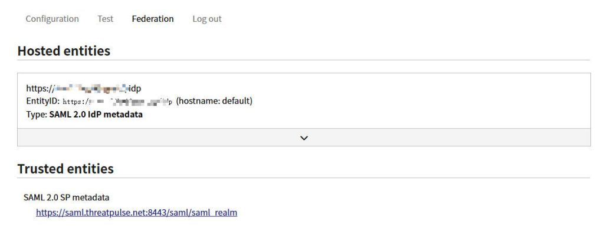
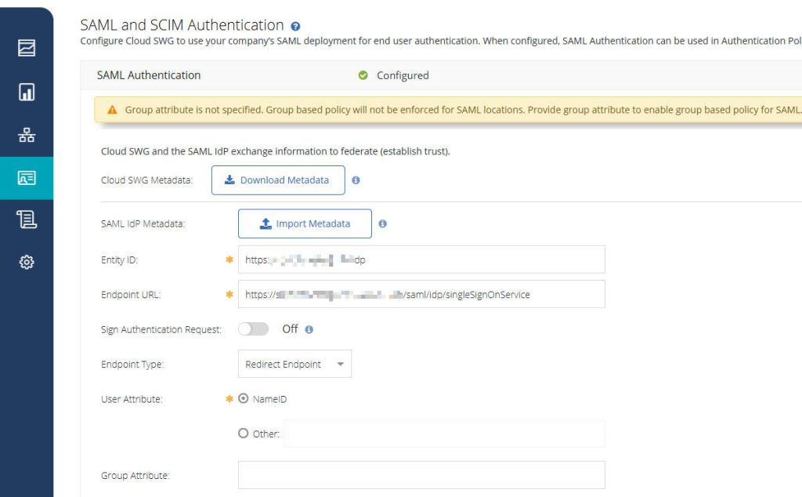
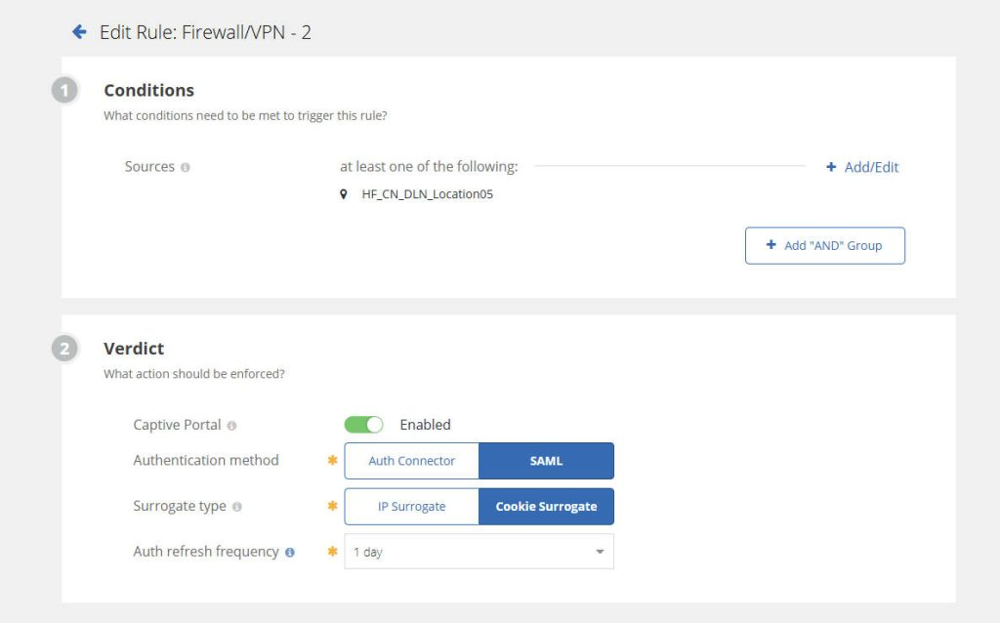
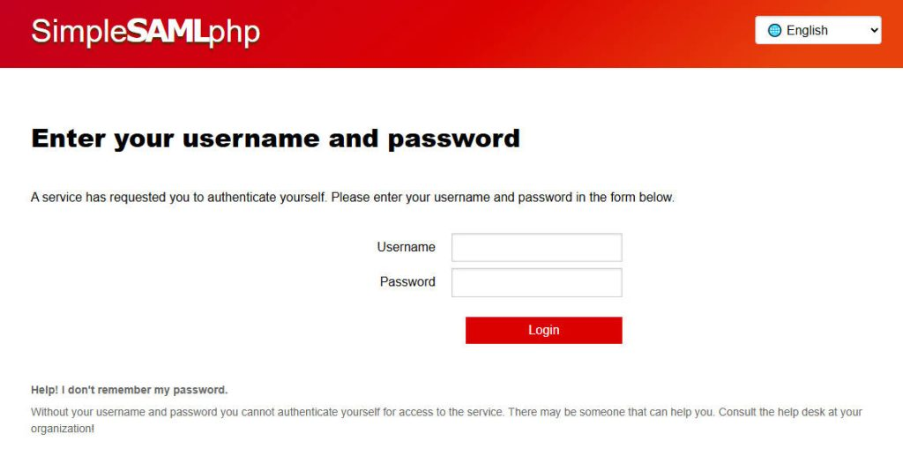

# Integrating Symantec Cloud SWG with SimpleSAMLphp for Seamless Authentication

------

## Why SAML Authentication?

SAML (Security Assertion Markup Language) is an XML-based open standard for exchanging authentication and authorization data between an identity provider (IdP) and a service provider (SP). For our setup:

- **Symantec Cloud SWG** acts as the **Service Provider (SP)**, relying on an external system for user authentication.
- **SimpleSAMLphp** will be configured as our **Identity Provider (IdP)**, responsible for authenticating users and sending assertions back to the SWG.

This approach offers:

- **Single Sign-On (SSO):** Users authenticate once with the IdP and gain access to resources protected by the SWG without re-entering credentials.
- **Centralized User Management:** User accounts are managed in your IdP, simplifying administration.
- **Enhanced Security:** Leveraging a dedicated IdP can provide advanced authentication features like multi-factor authentication (MFA).

------

## Prerequisites

Before we dive in, ensure you have the following:

1. **Symantec Cloud SWG Account:** Access to your Symantec Cloud SWG management console.
2. **SimpleSAMLphp Installation:** SimpleSAMLphp installed and configured on your web server. If you haven’t, refer to the [Installing SimpleSAMLphp with Nginx](https://lihaifeng.net/?p=1539) for installation instructions.
3. **Understanding of SAML:** Basic familiarity with SAML concepts will be helpful.

------

## Step-by-Step Configuration

We’ll divide this into two main parts: configuring SimpleSAMLphp (IdP) and configuring Symantec Cloud SWG (SP).

### Part 1: Configuring SimpleSAMLphp (Identity Provider)

- **Enable the IdP Module (`config.php`):** Ensure the `enable.saml20-idp` option is set to `true` in `config.php`:` enable.saml20-idp' => true,`

- Configure Authentication Source (`authsources.php`):

     

    In simplesamlphp/config/authsources.php, define how SimpleSAMLphp will authenticate users. For simplicity, we’ll use the example-static authentication source, but in a production environment, you’d integrate with an LDAP directory, database, etc.

    - **Important:** For production, integrate with a robust authentication backend like LDAP, a database, or an existing identity store.

```
'admin' => [
    'core:AdminPassword',
],

    'example-userpass' => [
        'exampleauth:UserPass',

        'users' => [
            'student:studentpass' => [
                'uid' => ['test'],
                'eduPersonAffiliation' => ['member', 'student'],
            ],
            'employee:employeepass' => [
                'uid' => ['employee'],
                'eduPersonAffiliation' => ['member', 'employee'],
            ],
        ],
    ],
```


- **Generate Certificates and Keys:** SimpleSAMLphp needs an X.509 certificate and private key for signing SAML assertions. If you don’t have them, SimpleSAMLphp can generate them. Ensure these files (`saml.crt` and `saml.pem`) are in the `simplesamlphp/cert` directory.

```
cd /path/to/simplesamlphp/cert
openssl req -newkey rsa:2048 -new -x509 -days 3650 -nodes -out saml.crt -keyout saml.pem
```

- **Configure IdP Metadata (`saml20-idp-hosted.php`):** In `simplesamlphp/metadata`, create or edit `saml20-idp-hosted.php`. This file defines your IdP’s metadata.` `After this, you should be able to access your SimpleSAMLphp administration interface (e.g., `https://your-simplesamlphp-domain.com/simplesaml/module.php/core/frontpage_auth.php`) and view the IdP metadata under the “Federation” tab. **Download this XML metadata file; you’ll need it for Symantec Cloud SWG.**

```
<?php
$metadata['__DYNAMIC:1__'] = [
    'host' => '__DEFAULT__',
    'privatekey'  => '/www/wwwroot/test.domain.com/cert/saml.pem',
    'certificate' => '/www/wwwroot/test.domain.com/cert/saml.crt',
    'auth' => 'example-userpass', // Or your configured auth source
];
```


------

### Part 2: Configuring Symantec Cloud SWG (Service Provider)

- Download IdP Metadata from SimpleSAMLphp and Import to SWG:
    - First, ensure your SimpleSAMLphp IdP is configured and running.
    - In your browser, navigate to your SimpleSAMLphp administration interface. This is typically a URL like `https://your-simplesamlphp-domain.com/simplesaml/module.php/admin`.
    - Log in if required.
    - Go to the “Federation” section.
    - You’ll find a link like `https://your-simplesamlphp-domain.com/simplesaml/module.php/saml/idp/metadata` – a direct download link for an XML file.
    - Access this link to **download the XML metadata file** to your local computer. This file contains all necessary information about SimpleSAMLphp as an Identity Provider, such as its entity ID, Single Sign-On URL, and signing certificate.



- **Access the Cloud SWG Management Console:** Log in to your Symantec Cloud SWG management console.
- **Navigate to Authentication Settings:** Go to **Identity** > **SAML and SCIM Authentication**.
- Configure the SAML Connector by Uploading Metadata:
    - **IdP Metadata:** You will see an option to **Upload Metadata File**. Click “**Import Metadata**“, and then select the XML metadata file you just downloaded from SimpleSAMLphp. The system will automatically parse and populate the relevant fields (e.g., Identity Provider Issuer/Entity ID, SSO URL, Signing Certificate).
- **Save the Configuration:** After all settings are complete, save your SAML authentication connector configuration.
- **Service Provider (SP) Metadata (from Cloud SWG):** After saving the SAML connector configuration, You’ll need to **download \**Service Provider (SP) metadata\**** **XML file**. This metadata contains the SWG’s `entityID` and Assertion Consumer Service (ACS) URLs.



------

### Part 3: Configure SimpleSAMLphp for the Service Provider (Symantec Cloud SWG)

Now, you need to tell SimpleSAMLphp about Symantec Cloud SWG as a Service Provider.

- **Add SP Metadata to SimpleSAMLphp:** In your `simplesamlphp/metadata` directory, create or edit `saml20-sp-remote.php`. Add the SP metadata you obtained from Symantec Cloud SWG here.` `**Crucially, ensure the `entityid` matches exactly the Service Provider Entity ID from the Symantec Cloud SWG metadata.** Also, copy the signing certificate from the SWG metadata into the `'certificate'` field in SimpleSAMLphp.

```
<?php
$metadata['YOUR_SYMANTEC_CLOUD_SWG_ENTITY_ID'] = [
    'SingleLogoutService' =>
        [
            0 =>
                [
                    'Binding' => 'urn:oasis:names:tc:SAML:2.0:bindings:HTTP-Redirect',
                    'Location' => 'https://login.threatpulse.com/saml/logout', // Example, verify from SWG metadata
                ],
        ],
    'AssertionConsumerService' =>
        [
            0 =>
                [
                    'Binding' => 'urn:oasis:names:tc:SAML:2.0:bindings:HTTP-POST',
                    'Location' => 'https://login.threatpulse.com/saml/ac/acs', // Example, verify from SWG metadata
                    'index' => 0,
                ],
        ],
    'nameIdFormat' => 'urn:oasis:names:tc:SAML:1.1:nameid-format:unspecified', // Or as required by SWG
    'entityid' => 'YOUR_SYMANTEC_CLOUD_SWG_ENTITY_ID', // This is the SP Entity ID from SWG metadata
    'redirect.validate' => TRUE, // Optional, can be set to false if issues, but enable for security
    'certificate' => 'MII...[SWG CERTIFICATE CONTENT]...', // The SWG's signing certificate
];
```


------

## Testing the Integration

- **Set Cloud SWG to use the SAML Connector:** In your Symantec Cloud SWG policies, configure a policy that uses the newly created SAML authentication connector for web access.



- **Access a Web Resource:** From a client machine configured to use Symantec Cloud SWG, attempt to access an internet website that triggers authentication (e.g., a site blocked by policy that requires user login, or just a generic web access if your SWG is configured to always authenticate).
- **Redirection to SimpleSAMLphp:** You should be redirected to your SimpleSAMLphp login page.
- **Authenticate:** Enter the credentials for a user defined in your SimpleSAMLphp authentication source.
- **Successful Access:** If authentication is successful, SimpleSAMLphp will send a SAML assertion to Symantec Cloud SWG, and you should gain access to the web resource.



------

By following these steps, you can successfully integrate Symantec Cloud SWG with SimpleSAMLphp for robust and centralized SAML authentication, enhancing your organization’s web security posture and user experience.