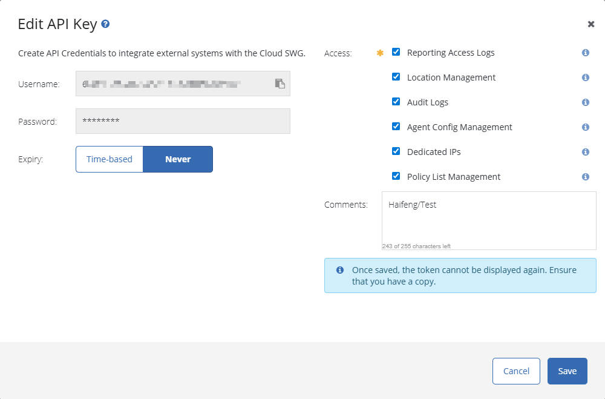

# Streamlining Symantec Cloud SWG Management with Python APIs

Symantec Cloud Secure Web Gateway (Cloud SWG) offers a powerful REST API interface, enabling seamless integration and automation for your security operations. This post will walk you through three common, practical use cases, demonstrating how to leverage the Cloud SWG API to boost your administrative efficiency:

1. **Retrieving Configured Locations:** Get an overview of your deployed SWG locations.
2. **Downloading Audit Logs:** Access crucial logs for compliance and activity tracing.
3. **Downloading Recent Report Logs:** Automate the collection of daily web traffic reports.

All examples are provided in Python, designed for clarity and immediate utility in your operational workflows.

------

## Configuring API Credentials in Cloud SWG

Before you can start using the API, you’ll need to generate your API credentials within the Symantec Cloud SWG portal. These credentials typically consist of an **API Username** and an **API Password**.

While the exact navigation might vary slightly with portal updates, the general steps are as follows:

1. **Log in** to your Symantec Cloud SWG portal.
2. Navigate to **Account > API Credentials**.
3. Here, you should see options to **Add+** or manage existing ones.
4. **Generate a new API Username and Password**. Make sure to note these down immediately, as the password only be displayed once.
5. Ensure the generated credentials have the necessary **permissions** to perform the actions you intend (e.g., read access for locations and log downloads).



Once you have your `API_USERNAME` and `API_PASSWORD`, you’re ready to integrate them into your scripts.

------

## Setting Up Your Environment with `.env` and `python-dotenv`

To keep your API credentials secure and out of your main codebase, we’ll use a `.env` file and the `python-dotenv` library.

First, install `python-dotenv`:

```
pip install python-dotenv requests
```

Next, create a file named **`.env`** in the same directory as your Python script (or in its parent directory). Add your Symantec Cloud SWG API credentials to this file like so:

```
# .env file

SWG_API_USERNAME="your_symantec_api_username"

SWG_API_PASSWORD="your_symantec_api_password"
```

**Important:** Never commit your `.env` file to version control (e.g., Git). Add it to your `.gitignore` file:

```
# .gitignore
.env
```

Now, let’s update our Python script to load these variables:

```
import requests
from requests.auth import HTTPBasicAuth
from datetime import datetime, timedelta
import os
from dotenv import load_dotenv

# --- Load environment variables from .env file ---
load_dotenv()

# --- API Credentials ---
# These will now be loaded from your .env file
API_USERNAME = os.getenv("SWG_API_USERNAME")
API_PASSWORD = os.getenv("SWG_API_PASSWORD")

# --- Base URLs for Symantec Cloud SWG API Endpoints ---
BASE_API_URL = "https://portal.threatpulse.com/api/rest"
REPORTPOD_URL = "https://portal.threatpulse.com/reportpod/logs/download"

# Basic check to ensure credentials are loaded
if not API_USERNAME or not API_PASSWORD:
    print("Warning: SWG_API_USERNAME or SWG_API_PASSWORD not found in environment variables or .env file.")
    print("Please set them in your .env file or as system environment variables.")
    exit(1)
```

Now, your Python script will automatically load the credentials from the `.env` file when it starts, providing a secure and flexible way to manage your API keys.

------

## Retrieve All Cloud SWG Location Information

Understanding your deployed Cloud SWG locations is fundamental for policy management and infrastructure monitoring. This script fetches all configured locations using a simple GET request with Basic Authentication.

```
## --- 1. Retrieve All Location Information ---
def get_all_locations():
    """
    Retrieves and prints details of all configured Symantec Cloud SWG locations.
    """
    print("\n--- Retrieving All Location Information ---")
    url = f"{BASE_API_URL}/locations"
    try:
        response = requests.get(url, auth=HTTPBasicAuth(API_USERNAME, API_PASSWORD))
        response.raise_for_status() # Raise an exception for HTTP errors (4xx or 5xx)

        locations = response.json()
        if locations:
            print("Successfully retrieved configured locations:")
            for location in locations:
                # Using .get() for safer dictionary access
                print(f"- ID: {location.get('id')} | Name: {location.get('name')}")
        else:
            print("No locations found or returned by the API.")
    except requests.exceptions.RequestException as e:
        print(f"Error retrieving locations: {e}")
    except ValueError as e:
        print(f"Error parsing JSON response for locations: {e}")

get_all_locations()
```

**Explanation:**

- We construct the URL using our `BASE_API_URL`.
- **`HTTPBasicAuth(API_USERNAME, API_PASSWORD)`** handles the Basic Authentication, which is straightforward for this endpoint.
- **`response.raise_for_status()`** is crucial for robust error handling. If the API returns an error status code (e.g., 401 Unauthorized, 404 Not Found, 500 Internal Server Error), this line will immediately raise an exception, preventing silent failures.
- The response is parsed as JSON, and we iterate through the list of dictionaries to extract `id` and `name` for each location.

------

## Download Cloud SWG Audit Logs (with Basic Authentication)

Audit logs are vital for compliance, security investigations, and tracing administrative activities. This example shows you how to download audit logs in CSV format for a specified date range, using **Basic Authentication** for consistency with the location retrieval.

```
## --- 2. Download Audit Logs ---
def download_audit_logs(start_date: str, end_date: str, file_name: str = "audit_log.csv"):
    """
    Downloads audit logs for a specified date range using Basic Authentication
    and saves them to a CSV file.

    Args:
        start_date (str): The start date in 'YYYY-MM-DD' format (e.g., '2025-07-01').
        end_date (str): The end date in 'YYYY-MM-DD' format (e.g., '2025-07-21').
        file_name (str): The name of the file to save the logs to.
    """
    print(f"\n--- Downloading Audit Logs from {start_date} to {end_date} (using Basic Auth) ---")
    url = f"{BASE_API_URL}/audit/download"
    params = {
        "startDate": start_date,
        "endDate": end_date,
        "format": "CSV"
    }

    try:
        # Use HTTPBasicAuth for authentication
        response = requests.get(url, auth=HTTPBasicAuth(API_USERNAME, API_PASSWORD), params=params)
        response.raise_for_status() # Raise an exception for HTTP errors (4xx or 5xx)

        with open(file_name, "wb") as f:
            f.write(response.content)
        print(f"Audit logs successfully downloaded to {file_name}")
    except requests.exceptions.RequestException as e:
        print(f"Error downloading audit logs: {e}")

today = datetime.utcnow().date()
twenty_days_ago = today - timedelta(days=20)
download_audit_logs(twenty_days_ago.isoformat(), today.isoformat(), "recent_audit_log.csv")
```

**Explanation:**

- We define `params` as a dictionary for URL query parameters, specifying the `startDate`, `endDate`, and desired `format`.
- **`auth=HTTPBasicAuth(API_USERNAME, API_PASSWORD)`** is used directly in the `requests.get()` call to perform Basic Authentication.
- The `response.content` is written directly to a binary file (`"wb"` mode) because the API returns raw CSV data.

------

## Download Recent Cloud SWG Report Logs

Automating the collection of daily report logs is invaluable for external analysis, long-term archiving, and integration with SIEM (Security Information and Event Management) systems. This script fetches daily logs for a specified number of recent days and saves them as a ZIP archive.

```
## --- 2. Download Audit Logs ---
def download_audit_logs(start_date: str, end_date: str, file_name: str = "audit_log.csv"):
    """
    Downloads audit logs for a specified date range using Basic Authentication
    and saves them to a CSV file.

    Args:
        start_date (str): The start date in 'YYYY-MM-DD' format (e.g., '2025-07-01').
        end_date (str): The end date in 'YYYY-MM-DD' format (e.g., '2025-07-21').
        file_name (str): The name of the file to save the logs to.
    """
    print(f"\n--- Downloading Audit Logs from {start_date} to {end_date} (using Basic Auth) ---")
    url = f"{BASE_API_URL}/audit/download"
    params = {
        "startDate": start_date,
        "endDate": end_date,
        "format": "CSV"
    }

    try:
        # Use HTTPBasicAuth for authentication
        response = requests.get(url, auth=HTTPBasicAuth(API_USERNAME, API_PASSWORD), params=params)
        response.raise_for_status() # Raise an exception for HTTP errors (4xx or 5xx)

        with open(file_name, "wb") as f:
            f.write(response.content)
        print(f"Audit logs successfully downloaded to {file_name}")
    except requests.exceptions.RequestException as e:
        print(f"Error downloading audit logs: {e}")

today = datetime.utcnow().date()
twenty_days_ago = today - timedelta(days=20)
download_audit_logs(twenty_days_ago.isoformat(), today.isoformat(), "recent_audit_log.csv")
```

**Explanation:**

- This endpoint uses a different base URL (`REPORTPOD_URL`).
- We dynamically generate the list of dates for the `items` parameter. Note that `range(1, days + 1)` ensures we get logs for the *past* `days` (e.g., if `days=3`, it gets yesterday, the day before, and two days before that).
- The **`"Accept": "application/octet-stream"`** header is crucial to inform the API that we expect a binary stream (in this case, a ZIP file).
- Similar to audit logs, `response.content` is written directly to a binary file (`.zip` extension).

------

## Putting It All Together (Optional Execution Block)

To run all these examples sequentially, you can use the following execution block.

```
if __name__ == "__main__":
    print("--- Starting Symantec Cloud SWG API Operations ---")

    # 1. Retrieve All Location Information
    get_all_locations()

    # 2. Download Audit Logs
    current_date = datetime.utcnow().date()
    seven_days_ago = current_date - timedelta(days=7)
    download_audit_logs(seven_days_ago.isoformat(), current_date.isoformat(), "recent_audit_log.csv")

    # 3. Download Recent Report Logs
    download_recent_report_logs(days=5, "recent_report_logs.zip")

    print("\n--- All requested API operations completed. ---")
```


------

## Conclusion

By leveraging the Symantec Cloud SWG APIs and adopting secure practices like using `.env` files for credentials, administrators can significantly streamline configuration management, automate critical log collection, and gain enhanced visibility into web traffic.