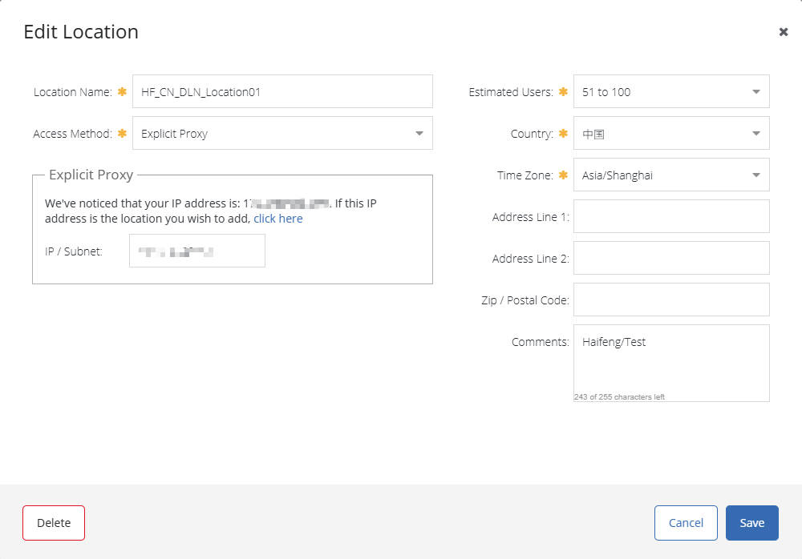
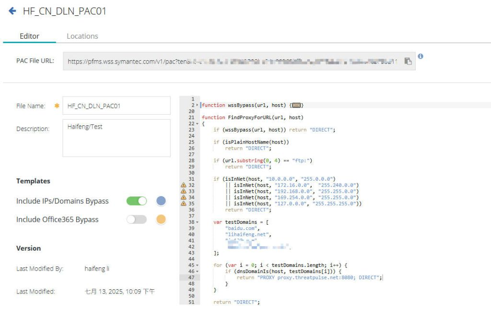
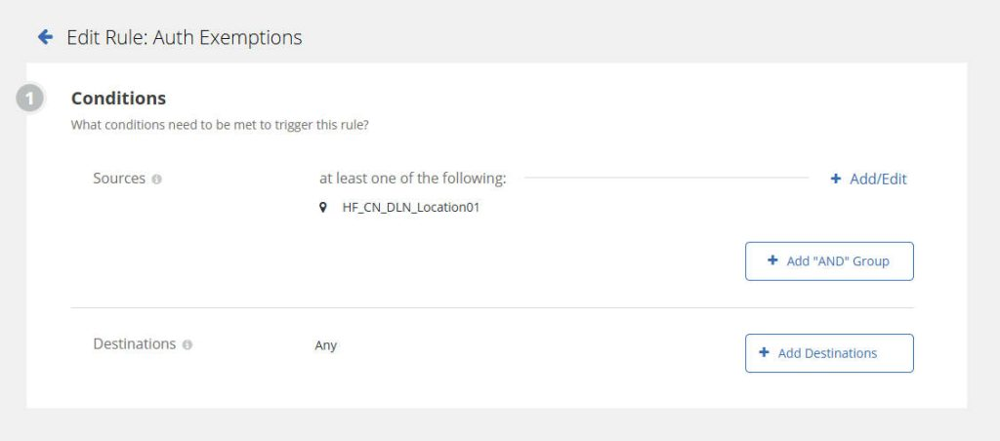
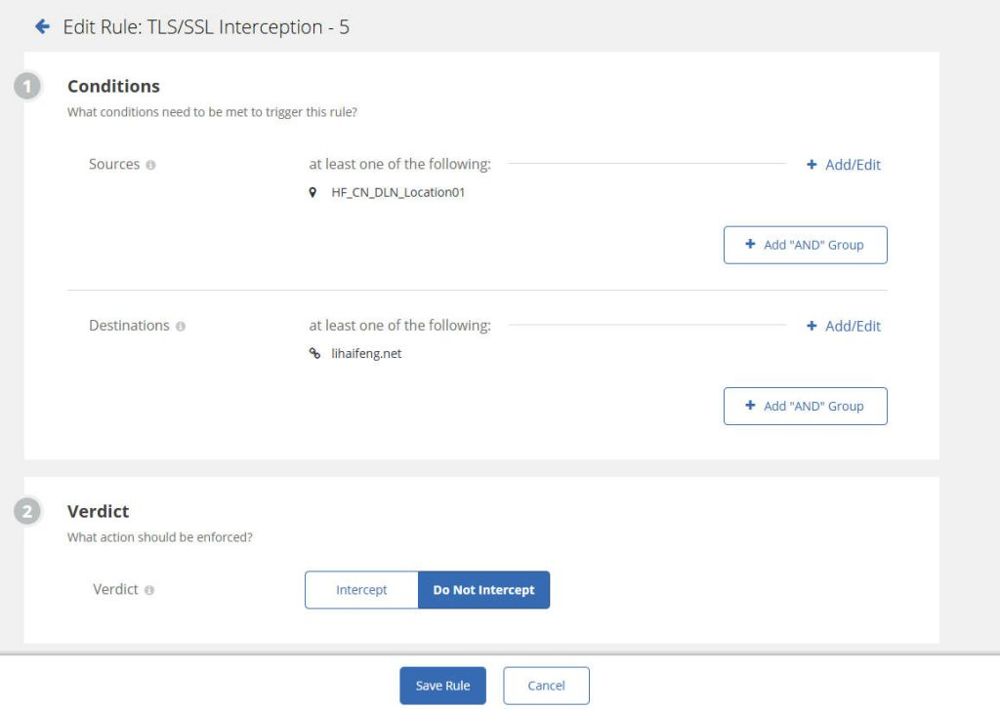
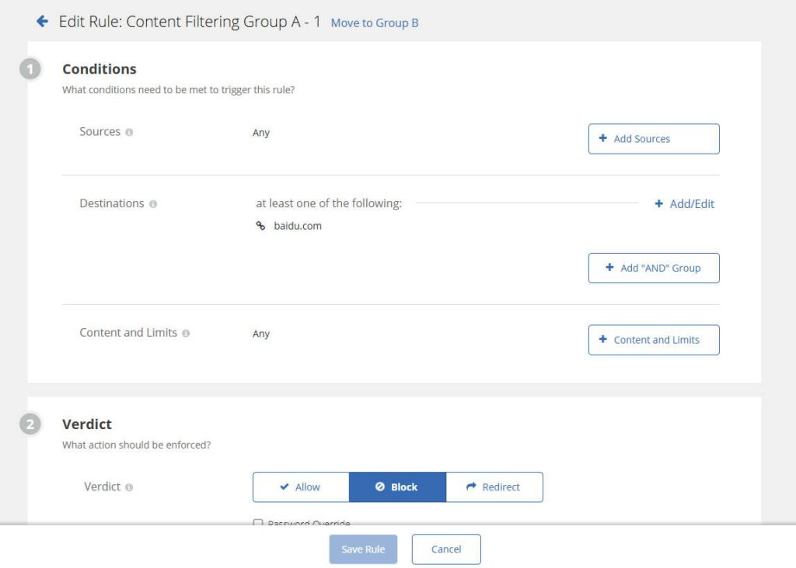
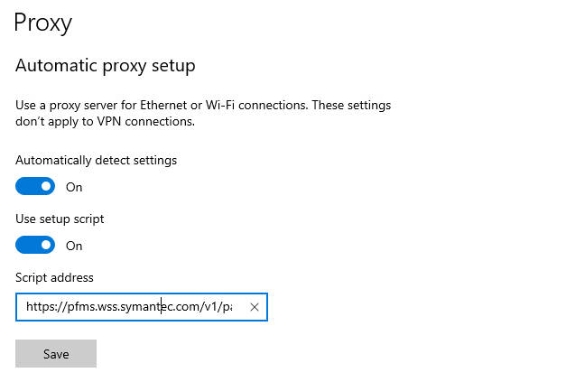
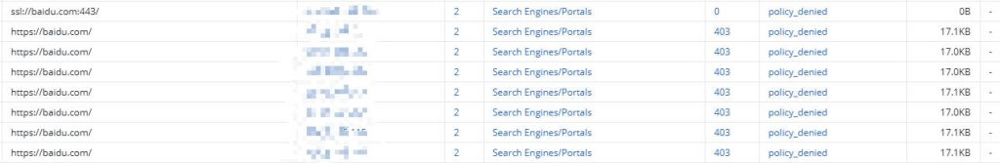
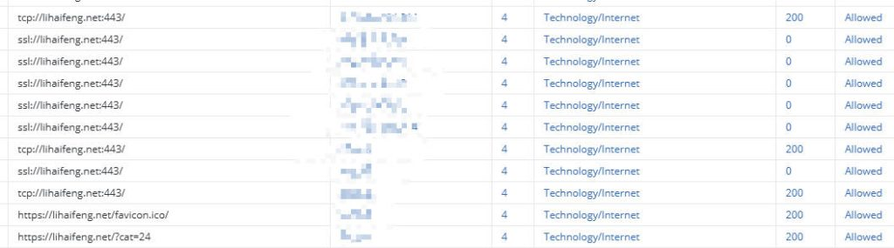

# How to Configure Explicit Proxy for Cloud SWG

In today’s rapidly evolving digital landscape, protecting enterprise networks from increasingly sophisticated threats is crucial. A Cloud Security Web Gateway (Cloud SWG) acts as a robust solution, providing comprehensive security between users and the internet without the need to deploy and maintain on-premise appliances. This article will delve into the configuration of a common deployment model for Cloud SWG: **Explicit Proxy**, with a specific focus on **Symantec Cloud SWG**.

### What is an Explicit Proxy?

An explicit proxy is the most direct deployment method for a Cloud SWG. In this mode, clients (such as a user’s browser or application) are **explicitly configured** to send all their web traffic to the Cloud SWG. This means the client knows about the proxy’s existence and actively routes its network requests to the Cloud SWG for inspection, filtering, and policy enforcement before forwarding them to the destination website.

Unlike a transparent proxy, where users don’t need to be aware of the proxy’s existence and traffic is forcibly redirected, an explicit proxy requires client-side configuration. While this might involve some initial setup, it offers greater control and visibility.

### Why Choose an Explicit Proxy?

The explicit proxy model offers several advantages:

- **Ease of Deployment and Understanding:** Compared to transparent proxies, the traffic path for an explicit proxy is clearer, making troubleshooting relatively simpler.
- **Granular Control:** You can control which traffic goes through the proxy based on users, groups, or specific applications, enabling more refined policy management.
- **Applicable to Various Devices:** Explicit proxy configurations work on a wide range of devices, including desktop computers, laptops, and mobile devices.
- **Support for Authentication:** Most Cloud SWG solutions support user authentication in explicit proxy mode, allowing different policies to be applied based on user identity.

------

### Configuring an Explicit Proxy for Symantec Cloud SWG: Step-by-Step

Configuring an explicit proxy for Symantec Cloud SWG involves specific steps within the Symantec management portal and on client devices.

#### 1. Symantec Cloud SWG Management Portal Configuration

First, you’ll need to make the necessary configurations within your [Symantec Cloud SWG portal](https://portal.threatpulse.com/) (typically known as the ThreatPulse Portal).

- Add an Explicit Proxy Location:
    - Log in to your Cloud SWG management portal.
    - Navigate to the **Connectivity** section, Select **Add Location**.
    - For the connection method, choose **Explicit Proxy**.
    - You’ll need to enter an **IP/Subnet**. This is typically your **public egress IP address** that the Cloud SWG will identify as coming from your authorized network to apply policies correctly.
    - Fill in the location name, estimated users, time zone, and other relevant information.
    - **Save** the configuration.



- Configure the PAC File:
    - In the management portal, find the **PAC File Manager**.
    - **You can configure your PAC file as needed to define proxy logic.** For comprehensive details on PAC file configuration methods, refer to the official Mozilla Developer Network guide: [Proxy Auto-Configuration (PAC) file](https://developer.mozilla.org/en-US/docs/Web/HTTP/Guides/Proxy_servers_and_tunneling/Proxy_Auto-Configuration_PAC_file).
    - **Here is the PAC file I tested**

```
function wssBypass(url, host) {
	return (
		shExpMatch(host, '*.webex.com') || shExpMatch(host, 'webex.com') ||
		shExpMatch(host, '*.windowsupdate.com') || shExpMatch(host, 'windowsupdate.com') ||
		shExpMatch(host, '*.zoom.us') || shExpMatch(host, 'zoom.us')
	);
}

function FindProxyForURL(url, host)
{
	if (wssBypass(url, host)) return "DIRECT";

    if (isPlainHostName(host))
        return "DIRECT";

    if (url.substring(0, 4) == "ftp:")
        return "DIRECT";

    if (isInNet(host, "10.0.0.0", "255.0.0.0")
        || isInNet(host, "172.16.0.0",  "255.240.0.0")
        || isInNet(host, "192.168.0.0", "255.255.0.0")
        || isInNet(host, "169.254.0.0", "255.255.0.0")
        || isInNet(host, "127.0.0.0", "255.255.255.0"))
        return "DIRECT";

    var testDomains = [
        "baidu.com",
        "lihaifeng.net",
        "abc.com",
        "efg.net",
    ];
    
    for (var i = 0; i < testDomains.length; i++) {
        if (dnsDomainIs(host, testDomains[i])) {
            return "PROXY proxy.threatpulse.net:8080; DIRECT";
        }
    }

    return "DIRECT";
}
```

- **After saving, you can use the generated PAC file URL**



- Configure Authentication:
    - Authentication is bypassed here for testing purposes. Detailed auth configuration will be discussed in a separate article.
    - Navigate to **Identity** → **Authentication Policy** to configure Global Exemption.
    - **Configure a global exemption** that allows all traffic to bypass authentication. This means users will not be prompted for credentials to access the internet via the Cloud SWG.
    - **Save** and **Activate** your policies.



- Configure TLS/SSL Interception:
    - Navigate to **Policy** → **TLS/SSL Interception**.
    - For easier testing, we’re choosing **‘Do not Intercept’** here. I’ll dive into TLS/SSL Interception in detail in other articles.
    - **Save** and **Activate** your policies.



- Configure Content Filtering (Block a Website for Testing):
    - To observe test results, let’s configure a simple content filtering rule.
    - Navigate to **Policy** > **Content Filtering**.
    - Add a rule and configure it as follows.
    - **Save** and **Activate** your policies.



------

#### 2. Client Device Configuration

Configuring client devices to use Symantec Cloud SWG as an explicit proxy is a crucial step.

- Using a PAC File (Recommended):
    - **Advantages:** Flexible, easy to manage, centrally deployable, supports complex routing logic.
    - Deployment Methods:
        - **Browser Settings:** In each client’s browser proxy settings, select “Use automatic configuration script” and enter the PAC file URL obtained from the Cloud SWG portal.
        - **Operating System-Level Settings:** Configure the PAC file URL in the system network settings on Windows, macOS, or Linux.
        - **WPAD (Web Proxy Auto-Discovery Protocol):** If supported by your network, you can configure WPAD to automatically discover the PAC file, further simplifying deployment (though this requires careful configuration to avoid security risks).
- Manual Browser Proxy Settings (for limited testing):
    - **Advantages:** Simple and direct, suitable for small-scale testing.
    - **Deployment Method:** In the browser’s proxy settings, manually enter the Symantec Cloud SWG proxy IP address and port (often `proxy.threatpulse.net` or a specific IP address, and port `8080` or `8443`). Be sure to configure the proxy for both HTTP and HTTPS traffic.



### Verification

After configuration, it’s essential to perform the following verifications:

- **Access External Websites:** Ensure users can access internet websites normally. Since authentication is bypassed, you shouldn’t be prompted for credentials.
- **Test Blocked Website:** Attempt to access the specific website you configured to be blocked. You should see a block page from Symantec Cloud SWG. This confirms your content filtering is working via the explicit proxy.
- **Review Reports:** Log in to the Cloud SWG portal and check web access logs in **Report Center**.






