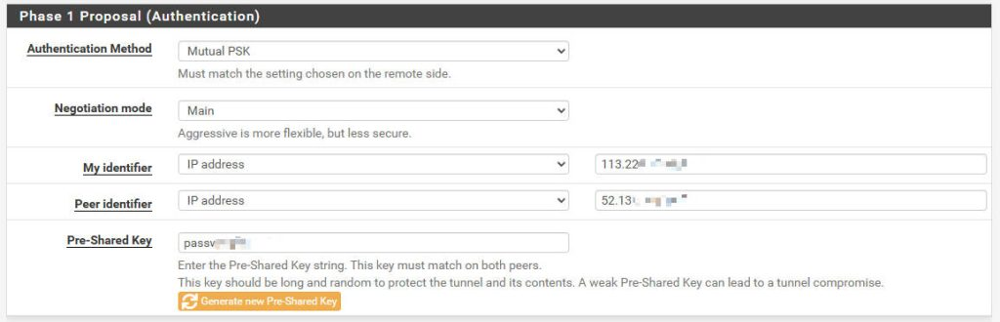

# Configuring Symantec Cloud SWG Static IP IPsec VPN with pfSense

This article will provide a detailed guide on how to establish an **IPsec VPN tunnel** between your **pfSense firewall** and **Symantec Cloud Secure Web Gateway (SWG)** using a static IP. This connection allows you to securely forward your internal network’s web traffic to Symantec Cloud SWG for centralized policy enforcement and filtering.

## Prerequisites

Before you begin the configuration, ensure you have the following information:

- **pfSense Installation**: If you haven’t already installed pfSense, you can refer to this guide: [pfSense Installation Guide](https://lihaifeng.net/?p=1365)
- **pfSense Public IP Address**: This is the public IP address of your pfSense firewall’s WAN interface.
- **Symantec Cloud SWG Data Center IP Address**: You’ll need to choose Symantec Cloud SWG data center IP addresse closest to you to act as tunnel destination. Symantec Cloud SWG typically provides a list of Ingress IP addresses. You can reference the official documentation for these addresses here: [Broadcom Cloud SWG Data Center IP Addresses](https://knowledge.broadcom.com/external/article?legacyId=TECH242979)

------

## Symantec Cloud SWG Portal Configuration

1. Add Location
    - Log in to the Symantec Cloud SWG administration portal.
    - Navigate to **Connectivity > Locations**.
    - Click **Add Location**.
    - **Name**: Give your location a descriptive name, such as “Office Name VPN”.
    - **Access Method**: Select **Firewall/VPN**.
    - **Gateway IP**: Enter your pfSense firewall’s public IP address.
    - **Authentication Key**: Enter your **Pre-Shared Key (PSK)**. This key will be used to authenticate communication between the SWG and firewall.
    - **Estimated Users**: Select the range of users sending web requests through this gateway interface.
    - **Timezone**: Select the time zone.
    - Click **Save**.
2. **(Optional) Configure Dual Tunnels for Failover**: Symantec recommends configuring two tunnels (primary and secondary) to ensure high availability. You’ll need to repeat the above steps for a second Symantec Cloud SWG data center IP address to create another Location.


------

## pfSense IPsec Configuration

Based on the pfSense configuration snippet, here are the detailed steps:

In the pfSense web interface, navigate to **VPN > IPsec > Tunnels**.

### Phase 1 Configuration (IKE)

Click **Add P1** or edit an existing Phase 1 entry.

- IKE Endpoint Configuration

    - Key Exchange Version

        ```
        IKEv1
        ```

    - Internet Protocol
      

        ```
        IPv4
        ```
        
    - Interface

         

        ```
    WAN
        ```
        
        (or your internet-facing interface)
    
    - **Remote gateway**: Your Symantec Cloud SWG data center IP address.


- Phase 1 Proposal (Authentication)

    - Authentication Method

         

        ```
    Mutual PSK
        ```
        
         
    
        (Pre-Shared Key)

    - My identifier

         

        ```
    IP address
        ```
        
         

        (your pfSense WAN interface’s public IP).
    
    - Peer identifier

         

        ```
    IP address
        ```
        
         

        (Your Symantec Cloud SWG data center IP).

    - Pre-Shared Key
    
      

        ```
        Your secure password
        ```

        (must match the Authentication Key configured in the Symantec Cloud SWG Portal).



- Phase 1 Proposal (Algorithms)

    - Encryption Algorithm

         

        ```
        AES 128 bits
        ```
        
    - Hash Algorithm
    
         

        ```
        SHA256
        ```
        
    - DH Group

         
    
        ```
        14 (2048 bit)
        ```


Click **Save** to apply the Phase 1 configuration.

### Phase 2 Configuration (IPsec)

Under the Phase 1 configuration page, click **Show Phase 2 Entries**, then click **Add P2**. Ensure the new Phase 2 entry is associated with the Phase 1 you just created.

- General Information

    - Mode

        ```
        Tunnel IPv4
        ```


- Networks

    - Local Network

         

        ```
    LAN subnet
        ```
        
         
    
        (or the specific internal network subnet whose traffic you want to send through the tunnel).

    - Remote Network

         

        ```
        0.0.0.0/0
        ```
        
         

        (This means all traffic will be sent through the tunnel to Cloud SWG, which is typical for web proxy routing).


- Phase 2 Proposal (Algorithms)

    - Protocol

         

        ```
        ESP
        ```
        
    - Encryption Algorithms
    
        ```
        AES 128 bits
        ```
        
        ```
        AES128-GCM 128 bits
        ```
        
    - Hash Algorithms

        ```
    SHA256
        ```

    - PFS Key Group

         

        ```
        14 (2048 bit)
        ```


Click **Save** to apply the Phase 2 configuration.

------

## Firewall Rule Configuration (pfSense)

After configuring the IPsec tunnel, you’ll need to add appropriate firewall rules on pfSense to allow traffic through the IPsec tunnel.

1. Navigate to Firewall > Rules > LAN

    - Add Rule

        This rule allows your LAN traffic to exit the LAN interface and be routed.

        - Action

             

            ```
        Pass
            ```
        
        - Interface
    
             

            ```
        LAN
            ```
        
        - Address Family
    
             
    
            ```
        IPv4
            ```
        
        - Protocol

             
    
            ```
            any
            ```
        
        - Source

             

            ```
    LAN subnet
            ```
            
             

            (or the specific IP address/subnet of your internal network).

        - Destination

             
    
            ```
            any
            ```
        
        - Description

             

            ```
        Allow all LAN outbound traffic
            ```
        
        - Click **Save**, then **Apply Changes**.

2. Navigate to Firewall > Rules > IPsec

    - Add Rule

        : This rule allows traffic that has been routed into the IPsec tunnel to pass through.

        - Action

             

            ```
            Pass
            ```
            
        - Interface
    
             

            ```
            IPsec
            ```
            
        - Address Family
        
             
    
            ```
            IPv4
            ```
            
        - Protocol

             
        
            ```
        any
            ```

            (or restrict to TCP with destination ports 80, 443 if preferred).

        - Source

             

            ```
        LAN subnet
            ```
            
             

            (or the specific IP address/subnet from your local network).

        - Destination
        
             
    
            ```
        any
            ```

            (since all web traffic will be routed through SWG).

        - Description

             

            ```
            Allow LAN to Cloud SWG through IPsec tunnel
            ```
            
        - Click **Save**, then **Apply Changes**.

------

## Verifying the Connection

Once configured, you can verify the IPsec connection using the following methods:

- **pfSense**: Navigate to **Status > IPsec**. Check the connection status of both Phase 1 and Phase 2 tunnels. If configured correctly, they should show as **connected**.

- Client Test

    From a device on your internal network, try accessing an external website. Then, check your Symantec Cloud SWG reports to confirm that the traffic is being proxied and filtered through SWG.

    - **Important:** For your client devices on the LAN to send traffic through pfSense and the IPsec tunnel, **ensure pfSense is configured as their default gateway.** This is typically done via your DHCP server settings on pfSense (Services > DHCP Server > LAN) or manually on static IP clients.


------

## Troubleshooting Tips

- **Check Logs**: pfSense system logs (**Status > System Logs > IPsec**) are an invaluable tool for troubleshooting IPsec connection issues.
- **Confirm IP Addresses and PSK**: Ensure that the **IP addresses** and **Pre-Shared Key** are an exact match on both pfSense and Symantec Cloud SWG.
- **Firewall Rules**: Carefully review all relevant firewall rules to ensure none are blocking IPsec traffic. Both the **LAN** and **IPsec** interface rules are critical.
- **Algorithm Compatibility**: Ensure that the **encryption, hashing, and DH group algorithms** configured on pfSense for both Phase 1 and Phase 2 are **supported by Symantec Cloud SWG**.

By following these steps, you should be able to successfully establish an IPsec VPN tunnel between your pfSense firewall and Symantec Cloud SWG, enabling secure web traffic management. If you encounter any issues, remember to systematically check each configuration step and consult the logs.