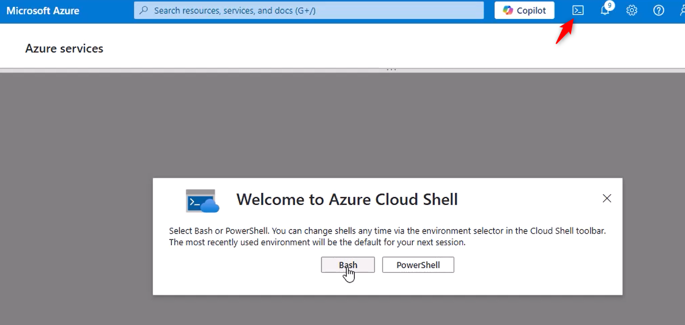

# Deploying Edge SWG Virtual Appliance on Azure

## 1. Download the Installation Package

From the Broadcom support portal, download the **Edge SWG Azure installation package**.
This package includes:

- The **VHD** file (e.g., `ProxySG_SWG_Azure_****.vhd`)
- The **`azure_create_image.bsh`** script
- The official installation instructions


------

## 2. Create a Storage Account in Azure

- In the **Azure Portal**, search for **Storage Accounts** and click **+ Create**.


- Enter a **Storage account name** (letters/numbers only — no hyphens or special characters).
- If you do not have a Resource Group yet, create one.
- **Region**: Select an appropriate region — note that prices vary, and cross-region transfers may incur extra costs.
- **Performance/Redundancy**: Choose defaults unless you have specific requirements.


- Ensure **Hierarchical namespace** is **disabled**.


- Ensure **Public network access** is **enabled** (required for upload).


Click **Review + Create**, then **Create**. Deployment takes a few minutes.


------

## 3. Create a Container and Upload the VHD

- Go to your new Storage Account → **Containers** → **+ Container**.
- Give it a name (e.g., `vhds`) and create it.


- Inside the container, click **Upload**.
- Select your `ProxySG_SWG_Azure_****.vhd` file from the installation package.
- **Important:** Set **Blob type** to **Page blob** — Azure requires page blobs for OS disks.
- Click **Upload** and wait for completion.


------

## 4. Prepare Azure Cloud Shell

- In the Portal’s top navigation bar, click the **Cloud Shell** icon.

- If this is your first time, follow the 

  Getting Started

   setup:

  - Choose **Bash**.

- When prompted for storage, select the Storage Account you just created.

- Once initialized, you will see a shell prompt.




------

## 5. Upload and Run the Deployment Script

- In Cloud Shell, upload the `azure_create_image.bsh` script from the installation package.
- Use the **Upload/Download files** button in the Cloud Shell toolbar.


- Make it executable: `bash chmod +x azure_create_image.bsh`
- Run the script with the following format:

```
./azure_create_image.bsh \ --image-name <va-image-name> \ --location <resource-group-location> \ --resource-group <resource-group-name> \ --subscription <subscription-id> \ --storage-account <storage-account-name> \ --container <container-name> \ --os-disk <os-disk-name>
```

**Parameter details:**

- `--image-name` : Name for the Managed Image (e.g., `edge-swg-img`).
- `--location` : Azure region (must match Resource Group’s region).
- `--resource-group` : Resource Group name.
- `--subscription` : Subscription ID (find under **Subscriptions** in Portal).
- `--storage-account` : Your Storage Account name.
- `--container` : The container holding the VHD.
- `--os-disk` : The VHD file name inside the container.


------

## 6. Create the Virtual Machine

- Go to **Images** in the Azure Portal and select the image created by the script.


- Click **+ Create VM**.


- Basics

  :

  - VM name (e.g., `edge-swg-01`)
  - Region will be pre-selected (from image)
  - Size: Minimum 2 vCPUs, 8 GB RAM. In this example: **B2ms**


- **Authentication**:
- Choose **SSH public key** or **Password** (password used in this guide).


- Disks

  :

  - The OS disk is preconfigured.
  - Add **two additional 100 GB data disks** (HDD to save costs).


- Networking

  :

  - Attach to your target VNet and Subnet.
  - Initially add a **Public IP** for configuration convenience (you can remove it later).


- Click **Review + Create** → **Create**. Deployment takes several minutes.

------

## 7. Configure Network Security Rules

- Go to the newly created VM → **Networking**.
- Edit the Network Security Group (NSG) to allow:
  - TCP **22** (SSH)
  - TCP **8080** (Proxy)
  - TCP **8082** (HTTPS management console)


------

## 8. Initial Appliance Setup

- SSH into the VM using the Public IP and the credentials you configured.
- Complete the initial Edge SWG configuration in the CLI.
- Reboot the appliance.


------

## 9. Access the Web Management Console

- In a browser, go to:

>  https://<VA_IP>:8082

- Log in with the credentials you set.

------

## 10. Install the License

- Navigate to **Maintenance → Licensing** in the web console.
- Click **Retrieve** or **Install License**.
- Log in with your Broadcom Support account to download and apply the license.


Refresh the page and confirm the license status is **active**.


------

## 11. Post-Deployment Notes

- Remove Public IP if not needed.
- Restrict NSG rules to trusted IPs.
