# Installing Symantec Edge SWG on VMware ESXi

Symantec Edge SWG (formerly ProxySG) provides robust web security, and deploying it on a virtualized platform like VMware ESXi offers significant advantages in terms of flexibility, scalability, and resource utilization. This guide will walk you through the steps to get your Edge SWG up and running in your virtual environment.

------

### Prerequisites

Before you begin, ensure you have the following:

- **VMware ESXi Host:** A properly configured ESXi host with sufficient resources (CPU, RAM, storage, and network interfaces) to allocate to the Edge SWG appliance. Refer to Symantec’s documentation for the recommended specifications for your chosen Edge SWG model.
- **Symantec Edge SWG OVA:** The virtual appliance file (OVA) for the Edge SWG. You can obtain this from Broadcom Support.
- **Web Browser:** For accessing the ESXi host client (web interface).
- **Symantec Edge SWG Serial Number:** You’ll need this during the initial configuration. For detailed instructions on how to obtain your Edge SWG appliance serial numbers, please refer to the official [**Broadcom TechDocs**](https://techdocs.broadcom.com/us/en/symantec-security-software/web-and-network-security/edge-swg/7-3/deploy-edge-swg-va/Gen2_Overview/Gen2_Before_You_Begin/Gen2_retrieve_appliance_serial_numbers.html).

------

### Step-by-Step Installation via ESXi Host Client

The easiest way to install Edge SWG on ESXi is by deploying the OVA template directly from the ESXi host client.

- **Log in to ESXi Host Client:** Open your web browser and navigate to the IP address of your ESXi host (e.g., `https://<ESXi_Host_IP_Address>`). Log in with your ESXi root credentials.
- Create/Register VM:
    - In the ESXi Host Client interface, click on **Virtual Machines** in the left-hand navigator.
    - Click on **Create/Register VM**.
- Deploy a virtual machine from an OVF or OVA file:
    - Select the option **“Deploy a virtual machine from an OVF or OVA file”** and click **Next**.
- Select OVF/OVA File:
    - Provide a **name** for your virtual machine (e.g., `Symantec-Edge-SWG`).
    - Click the “Click to select files” area or drag and drop your downloaded **Edge SWG OVA file** (e.g., **ProxySG-VA-100.ova** or **ProxySG-VA-200.ova**) and **vmdk** file into the designated area.
    - **Important:** The OVA file you choose (100 or 200) determines the virtual appliance’s initial resource allocation and performance capabilities. It’s crucial to consult Symantec’s official [**Edge SWG VA Sizing Reference**](https://techdocs.broadcom.com/us/en/symantec-security-software/web-and-network-security/edge-swg/7-3/deploy-edge-swg-va/va-sizing-reference/isg-vmware-sizing-reference.html) to select the appropriate OVA file for your expected traffic load and requirements *before* downloading.
    - Once the file is uploaded, click **Next**.

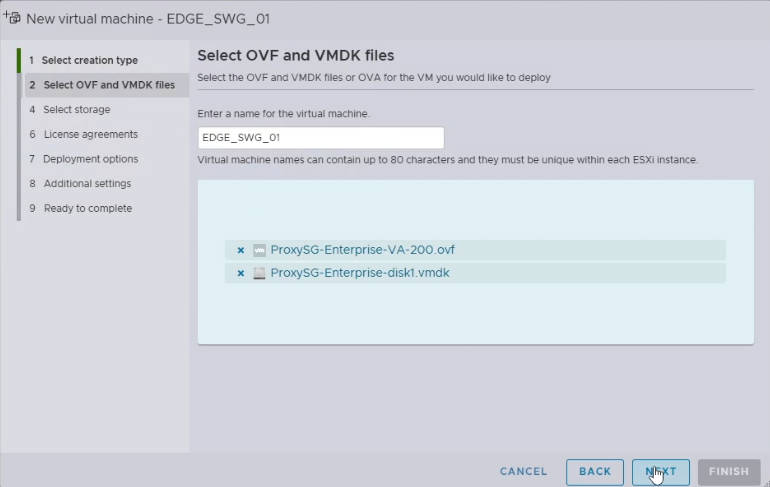

- Select Storage:
    - Choose the **datastore** where the virtual machine files will be stored. Ensure you have enough free space.
    - Click **Next**.
- Deployment Options:
    - **Network Mappings:** Map the primary virtual network adapter (often labeled `Network 1` or similar) to your designated **VM Network** or specific port group on your ESXi host. This network will carry both management and proxy traffic.
    - **Deployment Type:** During this step, you’ll see a dropdown or list showing different configurations available within the OVA. These options are typically named in a format like C1-12-2×100 (for the 100-series OVA) or C16-32-4×200 (for the 200-series OVA). Selecting one of these directly specifies the required CPU cores, memory (RAM), and disk space for your virtual appliance. Choose the configuration that best suits your needs, referencing the [**Broadcom sizing documentation**](https://techdocs.broadcom.com/us/en/symantec-security-software/web-and-network-security/edge-swg/7-3/deploy-edge-swg-va/va-sizing-reference/isg-vmware-sizing-reference.html) for clarity.
    - **Disk Provisioning:** Choose your desired disk provisioning. **Thin Provision** is often preferred for space efficiency, as it only consumes disk space as needed.
    - **Power on automatically:** You can check this box if you want the VM to power on immediately after creation.
    - Click **Next**.

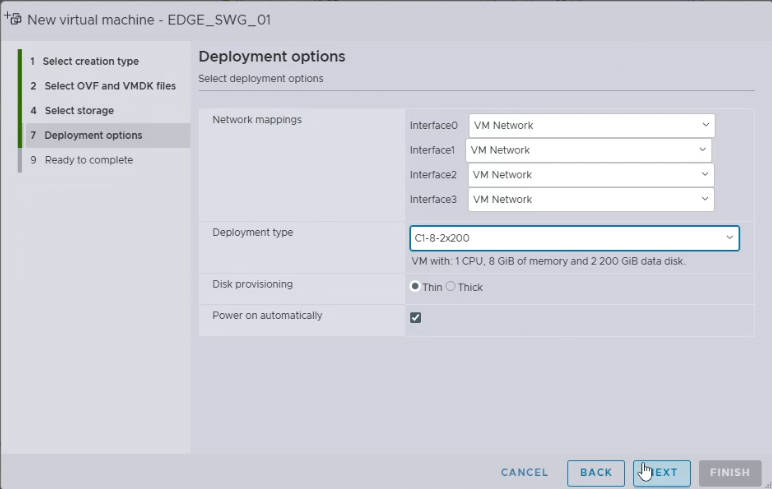

- Ready to Complete:
    - Review all your settings. If everything looks correct, click **Finish** to start the deployment.

The deployment process will take some time depending on the size of the OVA and your network speed.

------

### Power On and Initial Configuration

Once the OVA deployment is complete:

- **Power On the VM:** If you didn’t select “Power on automatically,” locate your newly deployed Edge SWG VM in the ESXi Host Client’s **Virtual Machines** list and power it on.
- **Open Console:** Click on the VM and then click the **Console** tab to open the virtual machine’s console.
- Initial Setup:
    - **Enter Serial Number:** The very first prompt will typically ask you to **enter the serial number** for your Edge SWG appliance.

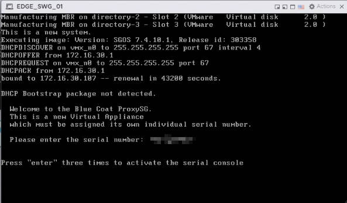

- Choose Installation Mode:

     

    Next, you’ll select the installation mode. Options usually include:

    - **Manual:** For standalone deployments where you’ll configure everything locally on the appliance.
    - **Director-managed setup:** Select this method if you are registering this Edge SWG with a Symantec Policy Center (Director). You will need to provide the Director appliance IP address and its registration password to continue with this setup. (For more details, refer to the [**Management Center** documentation](https://techdocs.broadcom.com/us/en/symantec-security-software/web-and-network-security/management-center/4-1.html)).

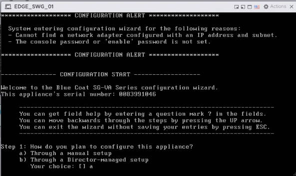

- **Select Interface:** The system might prompt you to **select the interface** you wish to configure (e.g., `0:0`). Choose the primary interface designated for both management and data traffic.

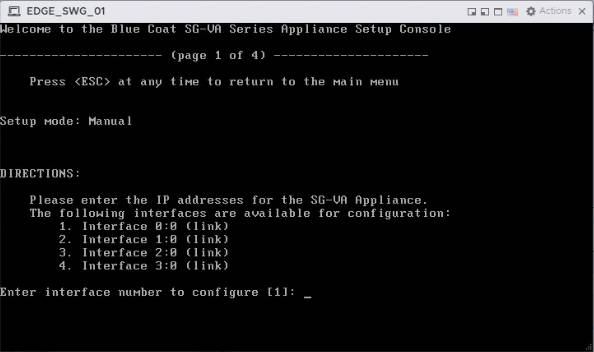

- **Configure IP Address:** You’ll then be prompted to set the **management IP address**, **subnet mask**, **default gateway**, and **DNS servers** for the selected interface.

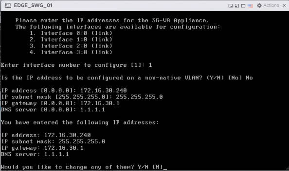

- **Set Passwords:** Finally, you’ll be asked to set the **enable password** (for elevated privileges within the CLI) and the **console password** (for accessing the console directly).

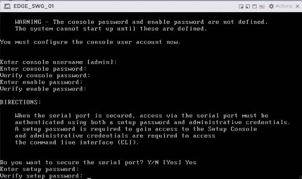

- Once the initial network configuration is complete, you should be able to access the Edge SWG’s command-line interface (CLI) or, more commonly, its web-based management interface.

------

### Accessing the Management Console

After initial setup, you can access the Edge SWG’s web-based management console from a web browser on your network.

- **Open Browser:** Open a web browser.
- **Enter IP Address:** Enter the management IP address you configured during the initial setup, followed by port **8082** (e.g., `https://<Edge_SWG_Management_IP>:8082`).
- **Login:** Use the default username (`admin`) and the password you set during initial configuration.

------

### Licensing Registration

- **Check Current License Status:** After logging into the management console, navigate to **Administration > Licensing > View**.
- In the “**Licensed Components**” section, you’ll see the license status displayed as **“No”**, and the expiration date might show as “1996”. This indicates the appliance doesn’t yet have valid licenses applied.

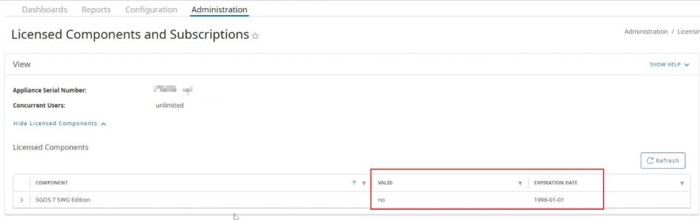

- **Initiate License Retrieval:** In the “**License Key Automatic Installation**” section, click the **“Retrieve”** button on the page.

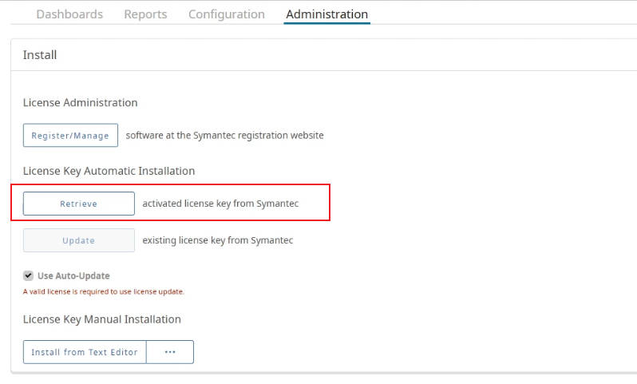

- **Enter Broadcom Credentials:** You’ll be prompted to enter your Broadcom credentials (username and password). Input these details and click **“Request License”**.

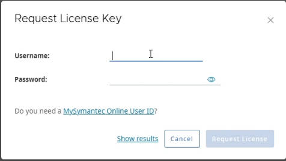

- **Confirm License Status Update:** The appliance will connect to the Broadcom licensing server, validate the serial number you entered earlier, and automatically download and install the associated licenses. **A restart of the appliance is generally NOT required after successful license registration.**
- Once the installation is complete, revisit the ***\*Administration\** > Licensing > View** page. You should now see License status showing as **“Yes”**, and the expiration dates updated to the correct future dates.

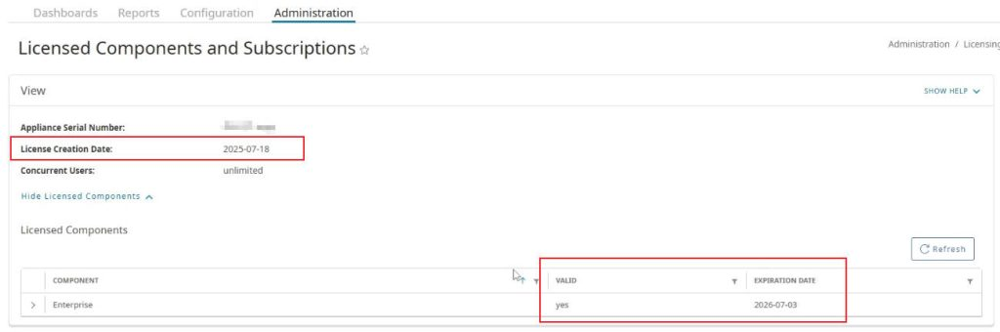

------

By following these steps, you’ll have your Symantec Edge SWG successfully installed and running on your VMware ESXi environment, ready to secure your organization’s web traffic.