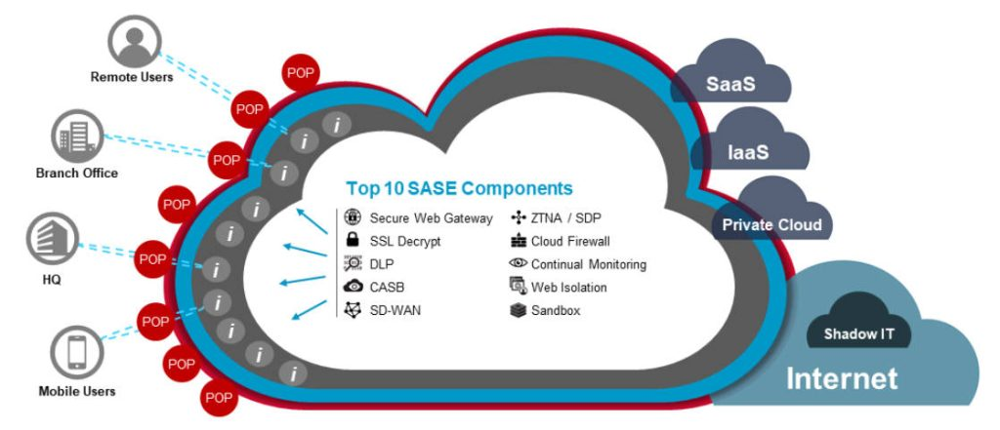

# SASE: Cloud-Era Secure Access

## Introduction

In today’s hyper-connected, cloud-driven world, traditional network architectures are no longer sufficient. With users working remotely, applications moving to the cloud, and cyber threats growing more complex, organizations need a new approach to secure connectivity.

Enter **SASE** — **Secure Access Service Edge** — a term coined by Gartner in 2019 that has quickly evolved from a buzzword into a blueprint for modern networking and security.

------

## What is SASE?

**SASE (Secure Access Service Edge)** is an architecture that converges **networking and security functions into a single, cloud-native platform**, delivered from globally distributed points of presence (PoPs).

SASE shifts the focus from **securing the perimeter** to **securing access**, no matter where users, devices, or applications reside. It enables secure, low-latency connections to SaaS, IaaS, on-prem, and edge locations — all based on identity, context, and real-time policy enforcement.

------

## Why Do We Need SASE?

The need for SASE arises from several converging trends:

#### 1. The Remote and Hybrid Workforce

The shift to remote and hybrid work models means users are no longer inside the corporate network. Traditional VPNs are no longer scalable or secure enough. SASE provides **direct-to-cloud** access with **identity-based authentication** and **zero trust principles**.

#### 2. Cloud-First Strategy

With the widespread adoption of cloud services like Microsoft 365, Salesforce, and AWS, backhauling traffic through data centers introduces **latency and cost**. SASE delivers **secure local breakouts** to cloud apps, improving performance and user experience.

#### 3. Increasing Threat Complexity

Modern cyber threats—ransomware, phishing, data exfiltration—are more advanced and often bypass legacy defenses. SASE provides **centralized, cloud-based threat detection and prevention** close to users, ensuring consistent protection.

#### 4. IT Simplification and Cost Efficiency

SASE **reduces the need for multiple point solutions** (VPN, firewall, SWG, DLP, etc.), simplifying architecture and lowering total cost of ownership. It centralizes management and policy enforcement for better agility and visibility.

------

## Core Components of SASE

[Selected Network and Security Technologies in the Symantec SASE Cloud](https://symantec.broadcom.com/hubfs/SED/SASE Page/White_Paper_SASE_ Symantec_SASE_Foundation.pdf)

SASE is composed of several tightly integrated cloud-delivered services. Let’s explore each:

#### SD-WAN (Software-Defined Wide Area Network)

- Replaces traditional WAN architectures with application-aware routing.
- Ensures reliable and optimized connections across multiple links (MPLS, LTE, broadband).
- Foundational for connecting remote offices to SASE cloud PoPs.

#### SWG (Secure Web Gateway)

- Filters web traffic to block malware, phishing, and malicious URLs.
- Enforces acceptable use policies (e.g., blocking gambling, adult content).
- Provides granular control over web access behavior.

#### CASB (Cloud Access Security Broker)

- Provides visibility and control over shadow IT and SaaS usage.
- Detects risky cloud behaviors and applies DLP and access policies.
- Critical for securing sanctioned and unsanctioned cloud services.

#### ZTNA (Zero Trust Network Access)

- Replaces legacy VPN with **user- and device-aware** access controls.
- Grants least-privileged access to specific apps, not the entire network.
- Enforces identity verification and posture checks before access.

#### FWaaS (Firewall as a Service)

- Cloud-delivered firewall capabilities: access control, intrusion prevention, and logging.
- Scales across all locations and users without hardware appliances.
- Centralizes management and applies consistent policies.

------

## Leading Vendors and Their SASE Strategies

#### Cisco

Cisco combines networking leadership with cloud security through:

- **Cisco SD-WAN**: This forms the backbone for robust and intelligent connectivity. It ensures optimized routing, application performance, and resilience across various network environments.
- **Cisco Umbrella**: A powerful, cloud-delivered service that acts as a Secure Web Gateway (SWG), provides DNS-layer security, integrates Cloud Access Security Broker (CASB) capabilities, and offers Firewall as a Service (FWaaS). This combination provides broad security coverage from the cloud edge.
- **Duo Security**: Cisco’s solution for Zero Trust access and Multi-Factor Authentication (MFA). Duo ensures that only verified users and trusted devices can access applications and data, significantly reducing the risk of unauthorized access.
- **ThousandEyes**: This is crucial for end-to-end visibility and insights into network and application performance. ThousandEyes helps organizations proactively identify and troubleshoot issues across the entire digital experience, from the user to the application, regardless of network complexity.

#### Symantec (Broadcom)

Broadcom’s Symantec SASE offering focuses on **deep security integration**:

- **Secure Web Gateway (SWG)**: This is an enterprise-grade, cloud-delivered SWG that provides comprehensive web security. It includes critical features like Data Loss Prevention (DLP) and advanced malware protection, ensuring secure web access for users.
- **CloudSOC:** : CloudSOC acts as a robust CASB platform. It offers rich analytics, governance, and granular control over how cloud applications are used within your organization, helping to secure your data in the cloud.
- **VIP**: Identity-based Zero Trust access and strong authentication: VIP is a crucial element for implementing Zero Trust access. It provides strong authentication capabilities, enabling secure, identity-based access to applications and resources, minimizing the attack surface.
- **Data Loss Prevention (DLP)**: Beyond its integration into SWG, Symantec offers a comprehensive, enterprise-wide DLP solution. This helps prevent sensitive data from leaving your organization through various channels, enforcing compliance and protecting intellectual property.
- Suited for **large enterprises** with complex regulatory and policy requirements.

#### Zscaler

Zscaler pioneered cloud-native SASE with:

- **Zscaler Internet Access (ZIA)** for secure internet and SaaS access.
- **Zscaler Private Access (ZPA)** for Zero Trust access to internal apps.
- Rapid deployment, high scalability, and strong threat protection.

#### Palo Alto Networks

Through **Prisma Access**, Palo Alto provides:

- Unified SASE platform with integrated SD-WAN, SWG, CASB, and ZTNA.
- Strong threat prevention from its **WildFire** and **Cortex XDR** engines.

#### Fortinet

Fortinet offers a **performance-optimized SASE** solution:

- Combines **FortiSASE**, **FortiGate NGFW**, and **FortiClient**.
- Focuses on **cost-effectiveness**, especially in hybrid on-prem/cloud environments.

------

## Future Outlook: Where is SASE Going?

#### AI-Powered Security

Future SASE platforms will increasingly leverage **AI/ML** for behavior-based threat detection, automated policy generation, and intelligent response. AI will help SASE adapt dynamically to evolving threats and network conditions.

#### Deeper Integration with Identity Providers

SASE is evolving to work more closely with **identity platforms** (e.g., Okta, Azure AD) to enforce granular access controls, adaptive policies, and continuous authentication across all resources.

#### Edge Computing and IoT Integration

As edge computing and IoT grow, SASE will extend to **secure data processing at the edge**, ensuring secure access and communication even outside the traditional corporate WAN.

#### Consolidation and Vendor Ecosystems

Vendors will increasingly offer **fully integrated SASE suites**, replacing today’s patchwork of tools. Expect more **acquisitions and partnerships** to accelerate convergence across networking and security stacks.

------

## Final Thoughts

SASE is more than a trend — it’s a strategic response to the changing nature of work, applications, and threats. By combining connectivity and security in a cloud-native model, SASE enables organizations to be more agile, secure, and resilient.

Whether you’re modernizing your WAN, improving remote access, or enhancing your security posture, **SASE provides a future-ready foundation**.

## References

**[Gartner – The Future of Network Security Is in the Cloud](https://assets-powerstores-com.s3.amazonaws.com/data/org/20033/media/doc/the_future_of_network_security_is_in_the_cloud_int_1599852842797001fko4_(1)-9fb8d55d823780b55988b056046fbc1b.pdf)**

**[Gartner Glossary – Secure Access Service Edge (SASE)](https://www.gartner.com/en/information-technology/glossary/secure-access-service-edge-sase)**

**[Cisco – Secure Access Service Edge (SASE) Overview](https://www.cisco.com/site/us/en/solutions/secure-access-service-edge-sase/index.html)**

**[Cisco Umbrella – What Is SASE?](https://umbrella.cisco.com/secure-access-service-edge-sase/what-is-sase)**

**[Broadcom (Symantec) – Cloud Secure Web Gateway (Cloud SWG)](https://techdocs.broadcom.com/us/en/symantec-security-software/web-and-network-security/cloud-swg/help.html)**

**[Cisco – SASE Solution At-a-Glance](https://www.cisco.com/c/dam/global/en_hk/assets/pdfs/sase-at-a-glance.pdf)**

**[Zscaler – “The Future of Network Security Is in the Cloud”](https://www.zscaler.com/blogs/company-news/new-report-gartner-research-future-network-security-cloud)**

**[Wikipedia – Secure Access Service Edge](https://en.wikipedia.org/wiki/Secure_access_service_edge)**

**[SASE原理架构与实践](https://weread.qq.com/web/reader/8f732c80813ab970fg015721k45c322601945c48cce2e120#outline?noScroll=1)**