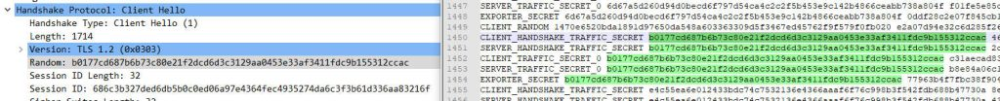
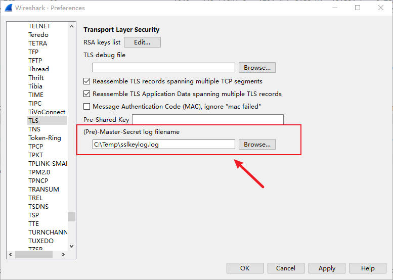

# Decrypting HTTPS Traffic with SSLKEYLOGFILE

In our daily online activities, HTTPS is the bedrock of our data security. It uses encryption to ensure our online communications, like banking, shopping, and social media interactions, are safe from eavesdropping and tampering. You might be curious about how to “decrypt” these seemingly unbreakable data packets in specific scenarios, especially within a Windows environment. Today, we’ll dive into a common decryption method: using **`SSLKEYLOGFILE`**, focusing on its practical application on Windows and detailing the contents of the `SSLKEYLOGFILE` itself, including entries relevant to the latest TLS 1.3 protocol.

------

### Why Do We Need to Decrypt HTTPS Packets?

Normally, we don’t need to, nor can we easily, decrypt HTTPS packets, as doing so would compromise their security. However, in certain controlled situations, decrypting HTTPS packets becomes necessary for specific purposes:

- **Network Security Analysis and Troubleshooting**: Security experts or network administrators might need to inspect encrypted traffic for malicious activity, performance issues, or configuration errors.
- **Development and Debugging**: Developers often need to see the actual communication content between their applications and servers to debug API calls or verify data transfer.

It’s crucial to emphasize that these decryption activities are typically performed in controlled and legitimate environments, requiring appropriate permissions and tools.

------

### `SSLKEYLOGFILE` Decryption Principle

The `SSLKEYLOGFILE` method offers a way to obtain HTTPS session keys without resorting to a man-in-the-middle (MitM) attack. Here’s its core principle:

1. **Key Derivation**: During the TLS/SSL handshake, the client and server collaboratively compute and derive **session keys** through a series of complex calculations. These keys are then used to encrypt and decrypt the data.
2. **Logging**: When the `SSLKEYLOGFILE` environment variable is set, supported browsers (like **Chrome** or **Firefox**) will write critical information used to generate session keys (such as **Pre-Master Secrets** or **Traffic Secrets**) into a specified file each time a new HTTPS connection is established. Each entry in this log contains the **Client Random** number, which uniquely identifies a specific TLS session, along with the corresponding key material.
3. **Wireshark’s Role**: **Wireshark** is a powerful network protocol analyzer. While it can’t “crack” HTTPS encryption on its own, when you load the `SSLKEYLOGFILE` into Wireshark, it can then **recalculate or directly obtain** the session keys by matching the **Client Random** number from the captured encrypted traffic with the key information recorded in the log file.
4. **Decryption and Display**: Once Wireshark successfully derives or obtains the session key, it can then decrypt the captured encrypted packets, just like the client and server would. This allows you to view the application-layer data (such as HTTP requests and responses) in a human-readable format.

In essence, `SSLKEYLOGFILE` provides a “backdoor” that allows tools like Wireshark to access the crucial “keys” needed to decrypt HTTPS traffic.

------

### Understanding the Contents of the `SSLKEYLOGFILE`

The `SSLKEYLOGFILE` is a plain text file, with each line representing the key information for an individual TLS session. Understanding these key types is crucial for correctly decrypting traffic from different TLS versions.

**1. For TLS 1.2 and Older Versions:**

These log entries typically record the **Pre-Master Secret**.

- Format: `CLIENT_RANDOM <client_random_hex> <pre_master_secret_hex>`
    - **`CLIENT_RANDOM`**: This identifies the entry as a record of the client random number and pre-master secret.
    - **`<client_random_hex>`**: This is the hexadecimal representation of the random number generated by the client at the start of the TLS handshake. It uniquely identifies a specific TLS session.
    - **`<pre_master_secret_hex>`**: This is the hexadecimal representation of the **Pre-Master Secret** negotiated through the key exchange algorithm. It’s a critical intermediate value used to derive the final session key.

**2. For TLS 1.3 Versions:**

TLS 1.3 significantly revamped its key derivation process, no longer directly using a pre-master secret for session key derivation. Instead, it introduced the concept of **“Traffic Secrets,”** which are used to encrypt different phases of the traffic. Consequently, you’ll see the following types of entries in the `SSLKEYLOGFILE` for TLS 1.3:

- `CLIENT_HANDSHAKE_TRAFFIC_SECRET <client_random_hex> <secret_value_hex>`
    - Used to encrypt handshake messages sent by the client during the handshake process.
- `SERVER_HANDSHAKE_TRAFFIC_SECRET <client_random_hex> <secret_value_hex>`
    - Used to encrypt handshake messages sent by the server during the handshake process.
- `CLIENT_APPLICATION_TRAFFIC_SECRET <client_random_hex> <secret_value_hex>`
    - Used to encrypt all application data sent by the client after the handshake is complete (e.g., HTTP requests). This is often the key used to decrypt the actual business data.
- `SERVER_APPLICATION_TRAFFIC_SECRET <client_random_hex> <secret_value_hex>`
    - Used to encrypt all application data sent by the server after the handshake is complete (e.g., HTTP responses). This is also a crucial key for decrypting real-world data.

**Example `SSLKEYLOGFILE` content snippet:**

\# TLS 1.2

```
CLIENT_RANDOM 67c7e59b9d3e8e1261d2d0b306b3a3b0a7b4c6e9f0e1d2c3b4a59687e8d9c0b1 1d2c3b4a59687e8d9c0b1a2b3c4d5e6f7a8b9c0d1e2f3a4b5c6d7e8f90a1b2c3
```

\# TLS 1.3

```
CLIENT_HANDSHAKE_TRAFFIC_SECRET 78d9c0b1a2b3c4d5e6f7a8b9c0d1e2f3g4h5i6j7k8l9m0n1o2p3q4r5s6t7u8v9 2e3f4a5b6c7d8e9f0a1b2c3d4e5f6g7h8i9j0k1l2m3n4o5p6q7r8s9t0u1v2w3x

SERVER_APPLICATION_TRAFFIC_SECRET 78d9c0b1a2b3c4d5e6f7a8b9c0d1e2f3g4h5i6j7k8l9m0n1o2p3q4r5s6t7u8v9 3f4a5b6c7d8e9f0a1b2c3d4e5f6g7h8i9j0k1l2m3n4o5p6q7r8s9t0u1v2w3x4y
```

Regardless of the key type, the **Client Random** remains the “fingerprint” that tools like Wireshark use to find matching sessions in the captured traffic. Once a match is found, it can use the corresponding key value provided in the log to decrypt the relevant traffic.



------

### Step-by-Step `SSLKEYLOGFILE` Usage on Windows

To decrypt HTTPS traffic using `SSLKEYLOGFILE` on Windows, follow these steps:

- Set the `SSLKEYLOGFILE` Environment Variable

    - In the Windows search bar, type “environment variables” and click on “Edit the system environment variables.”

    - In the “System Properties” window that appears, click the “Environment Variables…” button at the bottom right.

    - In the “Environment Variables” window, under “User variables” or “System variables,” click the “New…” button. Choosing “User variables” is usually simpler as it only affects your current user.

    - In the “New User Variable” window:

        - For **Variable name**, type: `SSLKEYLOGFILE`

        - For Variable value, type the full path and filename where you want to save the key log file. For example:

            ```
            C:\temp\sslkeylog.log
            ```

    - Click “OK” to save all changes.

- Launch or Restart Your Browser

    - **Crucially**: After setting the `SSLKEYLOGFILE` environment variable, **completely close and restart** your browser (**Chrome** or **Firefox**). The browser will only load the new environment variable upon a fresh launch.
    - Visit the HTTPS website you wish to decrypt. Your browser will now quietly write key information to the `SSLKEYLOGFILE` you specified. You should see this file being created and continuously updated.

- Capture Traffic with Wireshark

    - Launch **Wireshark**. If you haven’t installed it, you can download the latest version from the Wireshark official website.
    - On the Wireshark welcome screen, select the correct network interface (e.g., your Wi-Fi or Ethernet adapter).
    - Click the “Start capturing packets” button (usually a shark fin icon).
    - While Wireshark is capturing, perform some HTTPS Browse activity in your browser to ensure the traffic is recorded.

- Configure Wireshark for Decryption

    - Stop the capture in Wireshark (click the red square icon).
    - Go to **Edit -> Preferences**.
    - In the left-hand navigation pane, expand **Protocols** and then locate and click on **TLS** (or SSL in older versions).
    - In the right-hand panel, next to the “(Pre)-Master-Secret log filename” field, click the “Browse” button, and then select the SSLKEYLOGFILE you previously set up.
    - Click “OK” to save the settings.



- View Decrypted Traffic
    - Now, return to the main Wireshark window. Scroll through the captured packets.
    - You’ll notice that the previously encrypted HTTPS packets can now be expanded, allowing you to view their internal **application-layer data**.
    - To make it easier to view the decrypted HTTP requests and responses, you can apply a filter.

------

SSLKEYLOGFILE provides a powerful and relatively “stealthy” way to decrypt HTTPS, especially in a Windows environment, enabling developers and security researchers to conveniently inspect the true content of encrypted traffic.