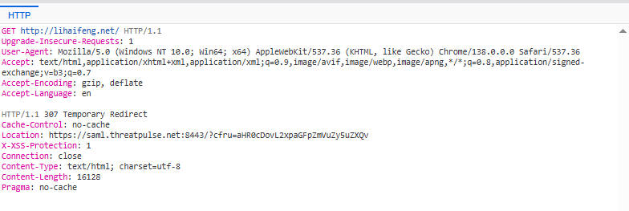
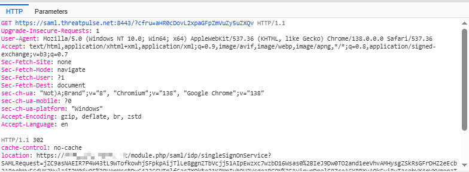
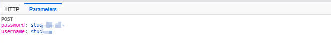
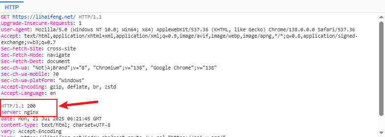

# How Does SAML Work? A Complete Step-by-Step Analysis of Single Sign-On

In today’s complex network environments, users often need to switch between multiple applications, and authenticating each time undoubtedly significantly reduces efficiency. To address this pain point, **Single Sign-On (SSO)** technology emerged, and **Security Assertion Markup Language (SAML)** is one of the most widely used and powerful protocols for implementing SSO.

------

### What is SAML?

SAML is an XML-based open standard for exchanging authentication and authorization data between different security domains. Simply put, it allows a Service Provider (SP) to trust user identity information issued by an Identity Provider (IdP). This means users only need to authenticate in one place (the IdP) to access multiple applications (SPs) without repeatedly logging in.

------

### Core Roles in SAML

To understand how SAML works, it’s crucial to identify its key players:

- **Principal**: Typically refers to the user who wants to access a service.
- **Identity Provider (IdP)**: Responsible for authenticating users and storing user identity information. Once a user successfully logs in at the IdP, the IdP generates a SAML assertion containing the user’s identity and authorization information.
- **Service Provider (SP)**: Provides the service or application that the user wants to access. The SP relies on the IdP to verify user identity and grants access to the user based on the SAML assertion.

------

### SAML Assertion Format

The SAML assertion is the core of SAML communication. It is an XML document containing information about user authentication, attributes, and authorization decisions. A typical SAML assertion usually includes the following main elements:

- **`<saml:Assertion>`**: The root element of the assertion.
- **`<saml:Issuer>`**: The issuer of the assertion, usually the IdP’s entity ID.
- **`<ds:Signature>`**: The digital signature of the assertion, used to ensure the integrity and authenticity of the assertion and prevent tampering.
- **`<saml:Subject>`**: Describes the asserted principal (user), usually containing the user’s unique identifier (NameID).
- **`<saml:Conditions>`**: Defines the validity conditions of the assertion, such as the assertion’s validity period and audience restrictions.
- **`<saml:AuthnStatement>`**: Contains information about the user’s authentication event, such as authentication time and method.
- **`<saml:AttributeStatement>`**: Contains user attribute information, such as email address, role, department, etc.
- **`<saml:AuthzDecisionStatement>`**: Contains authorization decision information (less commonly used).

------

### Detailed SAML Flow (with SAML Tracer Examples and Images)

The most common SAML 2.0 flow is the **SP-initiated SSO flow**. Let’s break down this process step-by-step, using the SAML Tracer output and the provided images:

**Overall Flow Overview:**

- **User Attempts to Access a Protected Resource on the SP (Initial Access and Internal Redirect):** The user enters or clicks a URL, such as `https://lihaifeng.net/` as shown in the logs. This access triggers an **HTTP 307 Redirect** to the SAML SP endpoint. This redirect is typically used to guide the user from a generic entry URL to a specific service URL that handles the SAML protocol.



- **SP Generates a SAML Authentication Request (AuthnRequest) and Redirects to the IdP:** Once the user’s browser is redirected to the SP’s SAML endpoint, the SP detects that the user is not yet authenticated. Therefore, the SP generates a **SAML AuthnRequest**. This request is typically URL-encoded, then placed in the URL parameters of an HTTP GET request (or in the `SAMLRequest` parameter of a POST request), and the user’s browser is redirected to the IdP’s SSO authentication endpoint via an **HTTP 302 Found Redirect**.



- SAML Tracer Example (AuthnRequest from SP to IdP):
    - `ID`: The unique identifier of the request (redacted).
    - `IssueInstant`: The time the request was generated, here `2025-07-21T06:21:28Z`.
    - `Issuer`: The entity ID of the SP, here `https://saml.threatpulse.net:8443/saml/saml_realm`. Immediately following the 307 redirect in the logs, there is a GET request whose `location` header points to `https://idp.example.com/module.php/saml/idp/singleSignOnService` and includes the `SAMLRequest` parameter. This is precisely the SAML authentication request initiated by the SP.

```
<?xml version="1.0"?>
<AuthnRequest xmlns="urn:oasis:names:tc:SAML:2.0:protocol" Version="2.0" ID="_redacted_id_ba2e62a3ff78a4c47142d486ef3827f536d7e2de881afcd4230aa39b3f6c1504" IssueInstant="2025-07-21T06:21:28Z">
    <Issuer xmlns="urn:oasis:names:tc:SAML:2.0:assertion">https://saml.threatpulse.net:8443/saml/saml_realm</Issuer>
</AuthnRequest>
```

- **User Authenticates at the IdP:** The browser redirects the user to the IdP. The logs show a subsequent `POST` request to `https://idp.example.com/module.php/core/loginuserpass`, with `username` and `password` (values hidden) in the `postData`. This indicates that the user is authenticating on the IdP’s login page. After successful authentication, the IdP generates a SAML assertion based on its configuration.



- IdP Generates a SAML Response and Redirects to the SP: The IdP sends the SAML Response, which contains the SAML assertion, back to the SP’s ACS URL via an HTTP POST request. This response is typically Base64 encoded. In the last request of the SAML Tracer log, we can see a POST request to the SP’s ACS URL (https://saml.threatpulse.net:8443/saml/saml_realm/bcsamlpost), with the SAMLResponse parameter in its postData.
    - SAML Tracer Example (from IdP to SP):
        - `ID`: The unique identifier of the response (redacted).
        - IssueInstant: The time the response was generated, here 2025-07-21T06:21:39Z.
        - `Destination`: The SP’s ACS URL, here `https://saml.threatpulse.net:8443/saml/saml_realm/bcsamlpost`.
        - `InResponseTo`: Corresponds to the ID of the AuthnRequest previously sent by the SP (redacted).
        - `saml:Status`: Indicates the authentication result; `Success` means successful.
        - `saml:Assertion`: The core part containing user identity information.
        - `saml:Issuer`: The entity ID of the IdP, here `https://idp.example.com/idp`.
        - `ds:Signature`: The IdP’s signature on the assertion (hidden); the SP will verify this signature using the IdP’s public key.
        - `saml:Subject`: Contains the user’s `NameID` (specific username hidden).
        - `saml:SubjectConfirmationData`: Additional conditions for validating the assertion, such as `NotOnOrAfter` (`2025-07-21T06:26:39Z`, expiration time) and `Recipient` (`https://saml.threatpulse.net:8443/saml/saml_realm/bcsamlpost`, recipient).
        - `saml:Conditions`: Conditions that limit the validity of the assertion, e.g., `NotBefore` (`2025-07-21T06:21:09Z`, effective time), `NotOnOrAfter` (`2025-07-21T06:26:39Z`, expiration time), and `AudienceRestriction` (specifying the recipient `https://saml.threatpulse.net:8443/saml/saml_realm`, ensuring it’s for the current SP).
        - `saml:AuthnStatement`: Contains information like authentication time (`2025-07-21T06:21:39Z`) and authentication method.
        - This log does not explicitly include `<saml:AttributeStatement>`, but in real-world applications, the IdP often sends various user attributes (e.g., email, role) to the SP here.

```
<samlp:Response xmlns:samlp="urn:oasis:names:tc:SAML:2.0:protocol"
                xmlns:saml="urn:oasis:names:tc:SAML:2.0:assertion"
                ID="_redacted_id_1ed13a6499ab0cc4ba61fa311edff38347ecd38641"
                Version="2.0"
                IssueInstant="2025-07-21T06:21:39Z"
                Destination="https://saml.threatpulse.net:8443/saml/saml_realm/bcsamlpost"
                InResponseTo="_redacted_id_ba2e62a3ff78a4c47142d486ef3827f536d7e2de881afcd4230aa39b3f6c1504">
    <saml:Issuer>https://idp.example.com/idp</saml:Issuer>
    <ds:Signature xmlns:ds="http://www.w3.org/2000/09/xmldsig#">
        <ds:SignedInfo>
            <ds:CanonicalizationMethod Algorithm="http://www.w3.org/2001/10/xml-exc-c14n#"/>
            <ds:SignatureMethod Algorithm="http://www.w3.org/2001/04/xmldsig-more#rsa-sha256"/>
            <ds:Reference URI="#_redacted_id_1ed13a6499ab0cc4ba61fa311edff38347ecd38641">
                <ds:Transforms>
                    <ds:Transform Algorithm="http://www.w3.org/2000/09/xmldsig#enveloped-signature"/>
                    <ds:Transform Algorithm="http://www.w3.org/2001/10/xml-exc-c14n#"/>
                </ds:Transforms>
                <ds:DigestMethod Algorithm="http://www.w3.org/2001/04/xmlenc#sha256"/>
                <ds:DigestValue>_redacted_digest_value_</ds:DigestValue>
            </ds:Reference>
        </ds:SignedInfo>
        <ds:SignatureValue>_redacted_signature_value_</ds:SignatureValue>
        <ds:KeyInfo>
            <ds:X509Data>
                <ds:X509Certificate>_redacted_certificate_</ds:X509Certificate>
            </ds:X509Data>
        </ds:KeyInfo>
    </ds:Signature>
    <samlp:Status>
        <samlp:StatusCode Value="urn:oasis:names:tc:SAML:2.0:status:Success"/>
    </samlp:Status>
    <saml:Assertion xmlns:xsi="http://www.w3.org/2001/XMLSchema-instance"
                    xmlns:xs="http://www.w3.org/2001/XMLSchema"
                    ID="_redacted_assertion_id_99fb960fc83f1fd60f1b5350dc9898045c9231e6bd"
                    Version="2.0"
                    IssueInstant="2025-07-21T06:21:39Z">
        <saml:Issuer>https://idp.example.com/idp</saml:Issuer>
        <ds:Signature xmlns:ds="http://www.w3.org/2000/09/xmldsig#">
            <ds:SignedInfo>
                <ds:CanonicalizationMethod Algorithm="http://www.w3.org/2001/10/xml-exc-c14n#"/>
                <ds:SignatureMethod Algorithm="http://www.w3.org/2001/04/xmldsig-more#rsa-sha256"/>
                <ds:Reference URI="#_redacted_assertion_id_99fb960fc83f1fd60f1b5350dc9898045c9231e6bd">
                    <ds:Transforms>
                        <ds:Transform Algorithm="http://www.w3.org/2000/09/xmldsig#enveloped-signature"/>
                        <ds:Transform Algorithm="http://www.w3.org/2001/10/xml-exc-c14n#"/>
                    </ds:Transforms>
                    <ds:DigestMethod Algorithm="http://www.w3.org/2001/04/xmlenc#sha256"/>
                    <ds:DigestValue>_redacted_digest_value_</ds:DigestValue>
                </ds:Reference>
            </ds:SignedInfo>
            <ds:SignatureValue>_redacted_signature_value_</ds:SignatureValue>
            <ds:KeyInfo>
                <ds:X509Data>
                    <ds:X509Certificate>_redacted_certificate_</ds:X509Certificate>
                </ds:X509Data>
            </ds:KeyInfo>
        </ds:Signature>
        <saml:Subject>
            <saml:NameID Format="urn:oasis:names:tc:SAML:2.0:nameid-format:transient">
                _redacted_username_
            </saml:NameID>
            <saml:SubjectConfirmation Method="urn:oasis:names:tc:SAML:2.0:cm:bearer">
                <saml:SubjectConfirmationData NotOnOrAfter="2025-07-21T06:26:39Z"
                                              Recipient="https://saml.threatpulse.net:8443/saml/saml_realm/bcsamlpost"
                                              InResponseTo="_redacted_id_ba2e62a3ff78a4c47142d486ef3827f536d7e2de881afcd4230aa39b3f6c1504"/>
            </saml:SubjectConfirmation>
        </saml:Subject>
        <saml:Conditions NotBefore="2025-07-21T06:21:09Z" NotOnOrAfter="2025-07-21T06:26:39Z">
            <saml:AudienceRestriction>
                <saml:Audience>https://saml.threatpulse.net:8443/saml/saml_realm</saml:Audience>
            </saml:AudienceRestriction>
        </saml:Conditions>
        <saml:AuthnStatement AuthnInstant="2025-07-21T06:21:39Z"
                             SessionIndex="_redacted_session_index_">
            <saml:AuthnContext>
                <saml:AuthnContextClassRef>urn:oasis:names:tc:SAML:2.0:ac:classes:PasswordProtectedTransport</saml:AuthnContextClassRef>
            </saml:AuthnContext>
        </saml:AuthnStatement>
    </saml:Assertion>
</samlp:Response>
```


- SP Validates the SAML Response and Grants User Access (Final Successful Access):

     

    Upon receiving the SAML Response, the SP performs the following critical steps:

    - **Verifies the digital signatures of the response and assertion**: Uses the IdP’s public key to verify the digital signatures of the SAML response and assertion, ensuring the information has not been tampered with and indeed originated from the IdP.
    - **Checks timestamps**: Verifies that the assertion is within its valid period (`NotBefore` and `NotOnOrAfter`).
    - **Validates `InResponseTo`**: Ensures the response matches the previously issued AuthnRequest.
    - **Validates `AudienceRestriction`**: Ensures the assertion is intended for the current SP.
    - **Extracts user information and attributes**: Extracts the user’s unique identifier (`NameID`) and other attribute information from the assertion.
    - **Creates a local session**: If all validations pass, the SP creates a local session for the user (e.g., sets a session cookie), and then redirects the user to the initially requested protected resource, which is `https://lihaifeng.net/`.



At this point, the user can successfully access resources on `https://lihaifeng.net/` without logging in again, completing the entire SAML Single Sign-On process.

------

### Conclusion

SAML, as a mature authentication protocol, greatly simplifies user experience and system administration by standardizing the exchange of identity information between different domains. Understanding the various roles in SAML, the assertion format, and its detailed SSO flow is crucial for building and maintaining secure distributed systems. We hope this article helps you gain a deeper understanding of SAML’s power!