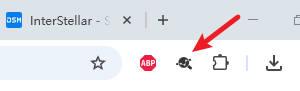
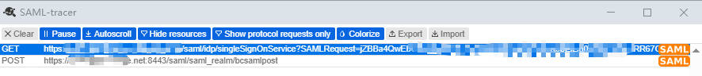

# Simplify Your SSO Debugging: A Guide to SAML Tracer

SAML (Security Assertion Markup Language) is a widely adopted XML standard used for Single Sign-On (SSO) in enterprise environments. When SSO issues arise, troubleshooting can be a daunting task without the right tools. This is where **SAML Tracer** comes to the rescue. It’s a browser extension that allows you to capture and analyze SAML messages, making it significantly easier to pinpoint the root cause of problems.

This blog post will provide a comprehensive guide on how to install and use SAML Tracer, empowering you to become a proficient SAML troubleshooter!

------

### What is SAML Tracer?

SAML Tracer is a browser extension that monitors all HTTP requests and responses transmitted between your browser and servers in real-time. It automatically identifies SAML messages within this traffic and presents them in a user-friendly format. This includes crucial information like requests, responses, signatures, and assertions, greatly simplifying the debugging and analysis of SAML flows.

------

### Installing SAML Tracer

SAML Tracer supports major web browsers such as Chrome and Firefox. The installation process is straightforward:

**For Google Chrome:**

1. Open Google Chrome.
2. Go directly to the **Chrome Web Store** via this link: [SAML-tracer – Chrome Web Store](https://chrome.google.com/webstore/detail/saml-tracer/mpdajninpobndbfcldcmbpnnbhibjmch)
3. Click the “**Add to Chrome**” button and follow the prompts to complete the installation.
4. Once installed, you’ll see the SAML Tracer icon (usually a circular icon) in your browser’s toolbar.

**For Mozilla Firefox:**

1. Open Mozilla Firefox.
2. Go directly to the **Firefox Add-ons website** via this link: [SAML-tracer – Get this Extension for Firefox](https://addons.mozilla.org/en-US/firefox/addon/saml-tracer/)
3. Click the “**Add to Firefox**” button and follow the prompts to complete the installation.
4. After installation, you’ll find the SAML Tracer icon in your Firefox toolbar.

------

### Using SAML Tracer

Once SAML Tracer is installed, you can start using it to track SAML messages.

#### 1. Enabling SAML Tracer

Before debugging, ensure SAML Tracer is **enabled**. Typically, clicking the SAML Tracer icon in your browser’s toolbar will open its panel. Within the panel, you’ll see all captured HTTP requests.

#### 2. Capturing SAML Traffic

To capture SAML traffic, simply perform your SSO flow in the browser while SAML Tracer is active. For example, try logging into an application that uses SAML for authentication. SAML Tracer will automatically identify and highlight the SAML requests and responses.

#### 3. Analyzing SAML Messages

When SAML Tracer captures a SAML message, it will be marked with different colors and icons in the panel. Clicking on these entries will allow you to view the detailed content of the SAML message.

SAML Tracer usually breaks down the SAML message into several key sections:

- **Summary:** Provides an overview of the SAML message, such as the request or response type, destination URL, message ID, etc.
- **SAML (XML):** This is the most crucial section, displaying the raw SAML XML message. You can examine the SAML assertion, attributes, conditions, signature, and more.
- **HTTP:** This tab displays the raw HTTP request or response data, including headers and POST data.
- **Params:** Lists the parameters included in the request or response.

#### 4. Sharing Your SAML Trace (Export/Import)

SAML Tracer makes it easy to **share captured logs** for troubleshooting or to save them for later analysis.

After capturing your SAML traffic, simply click the “**Export**” button in the SAML Tracer window. You’ll usually see an option to “**Mask Values**,” which you should **always select** when sharing logs to protect sensitive information. This will download a **JSON file** containing your trace.

If someone sends you a SAML trace file (a JSON file), you can open it directly in SAML Tracer using “**Import**” option within its panel. This lets you view the entire captured flow as if you recorded it yourself, making collaboration on complex issues much simpler.

------

### Conclusion

SAML Tracer is a powerful and user-friendly tool that is indispensable for anyone involved in SAML troubleshooting. Mastering its usage, including its handy export and import capabilities, will significantly enhance your ability to resolve SSO issues efficiently.