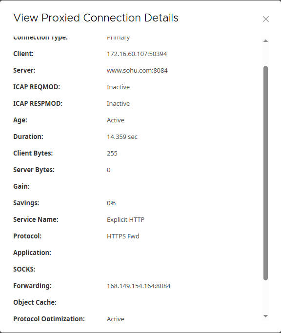

# Seamless Integration: Edge SWG and Cloud SWG Traffic Flow Control

## 1. Experiment Overview

This experiment aims to configure a Symantec Edge SWG (ProxySG) appliance to enable flexible client traffic forwarding based on different destination websites, integrating with Symantec Cloud SWG (Cloud Secure Web Gateway). The specific requirements are as follows:

- **Client Traffic**: Flows from the client to the Edge SWG, then forwarded based on policy.
- **Edge SWG -> Cloud SWG Forwarding**: Most traffic is forwarded to Cloud SWG for security inspection.
- **Specific Website (lihaifeng.net)**: Not forwarded, sent directly (Send Direct).
- **Specific Website (sohu.com)**: HTTPS traffic is intercepted and forwarded to Cloud SWG for rule inspection.
- **Other Websites**: All other HTTPS traffic is not intercepted and is forwarded to Cloud SWG.

## 2. Network Topology

Below is a diagram illustrating the network topology for this experiment:

```
                            +-------------------+
                            |                   |
                            |    Internet       |
                            |                   |
                            +--------+----------+
                                     ^
                                     |
                                     | Direct Connection
                                     |
[ Client 172.16.60.X ]               |
        |                            |
        | Explicit Proxy (Port 8080) |
        v                            |
+----------------+                   |
|                |                   |
|   Edge SG      +-------------------+
|                |
+--------+-------+
         |
         | Traffic Forwarding
         v
+----------------+                   +-------------------+
|                |                   |                   |
|   Cloud SWG    +------------------>|    Internet       |
|                |       Direct      |                   |
+----------------+       Connection  +-------------------+
```

**Topology Description:**

- **Client**: Located in the internal network, for example, with an IP address range of `172.16.60.0/24`. The client’s browser is configured to use the Edge SWG as a proxy server(`http://EDGW_SWG_IP:8080/proxy_pac_file`).
- **Edge SWG (ProxySG)**: Deployed between the internal and external networks, acting as the client’s proxy server. It is responsible for processing and forwarding traffic according to configured policies.
- **Cloud SWG (Symantec Cloud Secure Web Gateway)**: A cloud-based secure web gateway service provided by Symantec, responsible for performing deeper security inspections and policy enforcement on forwarded traffic. The Edge SWG forwards traffic to specific ports on the Cloud SWG.

## 3. Cloud SWG Configuration Overview

Before configuring the Edge SWG, you need to ensure your Symantec Cloud SWG environment is ready. This typically involves the following steps:

1. **Create Location**: In the Cloud SWG management portal, you need to create one or more locations for your network. These locations define the traffic source and allow you to apply location-based policies.
2. **Access Method**: Choose Proxy Forwarding, and you’ll need to enter Edge SWG **IP Address**, this is typically your **public egress IP address**.
3. **Configure Basic Policies (Optional)**: Depending on your requirements, configure basic web access policies, security policies, etc., in Cloud SWG. For this experiment, we primarily focus on the Edge SWG’s forwarding logic, with Cloud SWG acting as the backend for receiving and processing traffic.


**Important Note**: Cloud SWG will provide entry points (e.g., `proxy.threatpulse.net`) and corresponding ports (e.g., 8083, 8084, 8080) for traffic forwarding. This information will be used for Edge SWG’s forwarding host configuration.

[**Proxy Forwarding**](https://techdocs.broadcom.com/us/en/symantec-security-software/web-and-network-security/cloud-swg/help/ref-openports.html)

## 4. Edge SWG Configuration Steps

We will configure the Edge SWG through its management interface and Visual Policy Manager (VPM).

### 4.1 Certificate Import

SSL interception on the Edge SWG requires importing relevant certificates. If Cloud SWG also performs SSL interception, its certificate needs to be imported into the Edge SWG.

#### 4.1.1 Client Installation of Edge SWG’s SSL Interception Root Certificate

If the Edge SWG needs to perform SSL interception on client traffic (as for `sohu.com`), the Edge SWG requires a root CA certificate to issue forged certificates. Typically, the Edge SWG will have a `Default` keyring that contains a self-signed CA certificate.

**Important**: This Edge SWG root CA certificate needs to be imported into the trusted store of all clients; otherwise, clients will receive certificate warnings when accessing intercepted HTTPS websites.

**Steps to obtain the Edge SWG SSL interception root certificate**:

1. Log in to the Edge SWG management interface.
2. Navigate to **Dashboards > Advanced URLs > SSL > Download a Certificate as a CA certificate**.
3. On the download page. Click `default` certificate to download.
4. Distribute the downloaded `.cer` file to clients and instruct them to import it into browser-trusted list.

#### 4.1.2 Uploading the Cloud SWG Certificate to the Edge SWG Appliance

If Cloud SWG also intercepts forwarded traffic and you want the Edge SWG to trust certificates issued by Cloud SWG, you need to import the Cloud SWG’s root CA certificate into the Edge SWG’s trusted store.

**Step 1: Obtain the Cloud SWG Certificate**

1. In the **Cloud SWG portal**, navigate to **Policy > TLS/SSL Interception**.
2. Expand the **TLS/SSL Interception Certificate** area.
3. Click **Download**.
4. Click **Save File** and save the certificate to an internally accessible location.
5. Open the file with a text application (such as Notepad) and copy its contents to the clipboard.


**Step 2: Upload the Certificate to the Edge SWG Appliance**

1. In the Edge SWG Admin Console, select **Configuration > SSL > CA Certificates**.
2. In the CA Certificates section, click **Import**. The console opens an Import CA Certificate dialog:
3. Enter a unique **CA Certificate Name** (e.g., `CloudSWG_Root_CA`).
4. Click **Paste From Clipboard** to paste the Cloud SWG root certificate content from the clipboard into the field.
5. Click **OK**.
6. Click **Save**. The console displays a Save Changes dialog.
7. Click **Save Changes**. Wait for the appliance to save the certificate.


**Step 3: Add the Cloud SWG Certificate to the `browser-trusted` list**

1. In the **CA Certificate Lists** area, select `browser-trusted`. The console opens an Edit CA Certificate List page.
2. Click **Select Certificates**. The console opens a Select CA Certificates dialog.
3. If you are replacing an old certificate, locate the old certificate and clear its checkbox.
4. Locate and **Select** the previously imported **Cloud SWG root certificate** (e.g., `CloudSWG_Root_CA`).
5. Verify that the correct certificates are selected in the **CA Certificate Lists** list.
6. Click **Apply**.
7. Click **Save** to save the changes.


### 4.2 Configure Forwarding Hosts

These forwarding hosts define the destination addresses and ports on Cloud SWG to which the Edge SWG will forward traffic.

1. Log in to the Edge SWG management interface.

2. Navigate to **Configuration > Forwarding > Forwarding Hosts**.

3. Click **New** to create a new forwarding host.

4. Based on your Cloud SWG configuration, add the following forwarding hosts (replace with your actual Cloud SWG entry points):

    - Name: CloudSWG
        - **Host**: `proxy.threatpulse.net` (or your actual Cloud SWG entry point)
        - **Port**: `8443`
        - **Comments**: For HTTP traffic forwarding
    - Name: CloudSWG8084
        - **Host**: `proxy.threatpulse.net`
        - **Port**: `8084`
        - **Comments**: For locally-intercepted traffic forwarding
    - Name: CloudSWG8080
        - **Host**: `proxy.threatpulse.net`
        - **Port**: `8080`
        - **Comments**: For unintercepted traffic forwarding

    Click OK to save each forwarding host.


### 4.3 VPM Policy Configuration

Now, we will proceed to configure the specific forwarding and SSL interception policies in the VPM (Visual Policy Manager).

1. Navigate to **Configuration > Policy > Visual Policy Manager > Launch**.
2. Click **Add Layer > Forwarding Layer** and **Add Layer > SSL Intercept Layer** to create the necessary policy layers.


#### 4.3.1 Set Default Proxy Policy to Allow

To ensure that traffic not explicitly matched by other rules is allowed through the Edge SWG, we need to set the default proxy policy to **Allow**.

1. Log in to the Edge SWG management interface.
2. Navigate to **Configuration > Policy > Policy Options**.
3. In the **Default proxy policy** section, locate the horizontal selection menu with **Deny** and **Allow** options. Click the **Allow** option to select it (it should turn blue).
4. Click **Apply** to save the changes.


#### 4.3.3 Forwarding Layer Policy Configuration

Create the **Forwarding** policy layer.

1. Rule 1: lihaifeng.net Not Forwarded (Send Direct)
    - **Source**: Any
    - **Destination**: `Domain_lihaifeng_net`
    - **Action**: **Send Direct** (Right-click the action cell, select **Set > Forwarding > Send Direct**)
2. Rule 2: All HTTP Traffic Forwarded to Cloud SWG (Port 80)
    - **Source**: Any
    - **Destination**: `Port_80_HTTP`
    - **Action**: **Forward** (Right-click the action cell, select **Set > Forwarding > Forward**, then choose the previously defined `CloudSWG` forwarding host).
3. Rule 3: sohu.com Traffic Forwarded to Cloud SWG (Port 8084)
    - **Source**: Any
    - **Destination**: `URL_sohu_com`
    - **Action**: **Forward** (Right-click the action cell, select **Set > Forwarding > Forward**, then choose the previously defined `CloudSWG8443` forwarding host).
4. Rule 4: Default Forward to Cloud SWG (Port 8080)
    - **Source**: Any
    - **Destination**: `Any`
    - **Action**: **Forward** (Right-click the action cell, select **Set > Forwarding > Forward**, then choose the previously defined `CloudSWG8080` forwarding host).


#### 4.3.4 SSL Intercept Layer Policy Configuration

Create the **SSL Intercept Layer Policy** policy layer.

1. Rule 1: sohu.com Intercepted for Rule Inspection (with Issuer Keyring)
    - **Source**: `Client_Subnet_172_16_60_0_24`
    - **Destination**: `Domain_sohu_com`
    - **Action**: **Enable SSL Interception** (Right-click the action cell, select **Set > SSL Interception > Enable SSL Interception**. In the pop-up dialog, ensure the **Issuer Keyring** option is set to **Enable**.
2. Rule 2: Other Websites Not Intercepted
    - **Source**: `Client_Subnet_172_16_60_0_24`
    - **Destination**: Any
    - **Action**: **Disable SSL Interception** (Right-click the action cell, select **Set > SSL Interception > Disable SSL Interception**).


Once all VPM configurations are complete, click **Apply Policy** to apply the policy to the Edge SWG.

Here is the complete CPL file for your reference.

```
define condition __HostPort6_FORWARD_
    server_url.domain="lihaifeng.net"
end condition __HostPort6_FORWARD_

define condition __HostPort1_FORWARD_
    server_url.port=80
end condition __HostPort1_FORWARD_

define condition __HostPort4_FORWARD_
    server_url.domain="sohu.com"
end condition __HostPort4_FORWARD_

define condition __HostPort4
    url.domain="sohu.com"
end condition __HostPort4

;; Tab: [Forwarding HTTP/HTTPS]
<Forward>
    condition=__HostPort6_FORWARD_ socks_gateway(no) forward(no) ; Rule 1
    condition=__HostPort1_FORWARD_ forward("CloudSWG") forward.fail_open(yes) ; Rule 2
    condition=__HostPort4_FORWARD_ forward("CloudSWG8084") forward.fail_open(yes) ; Rule 3
    forward("CloudSWG8080") forward.fail_open(yes) ; Rule 4

;; Tab: [SSL Intercept Layer Policy]
<SSL-Intercept>
    client.address=172.16.60.0/24 condition=__HostPort4 ssl.forward_proxy(https) ssl.forward_proxy.issuer_keyring("default")  ; Rule 1
    client.address=172.16.60.0/24 ssl.forward_proxy(no)  ; Rule 2
```


### 4.4 Configure Proxy Services

To enable the Edge SWG to receive traffic as an explicit proxy from clients, you need to configure the appropriate proxy services.

1. Log in to the Edge SWG management interface.
2. Navigate to **Configuration > Services > Proxy Services**.
3. Locate Explicit HTTP service and edit.
    - **Service Type**: `Explicit HTTP`
    - **Name**: `Explicit_HTTP_Proxy` (or your preferred name)
    - **Port**: `8080/80`
    - **Detect protocol**: Enable
    - **Service Action**: Intercept
4. Click **OK** to save the service configuration.
5. Click **Apply** to make the changes effective.


## 5. Verification

After configuration, you need to test from the client and check the Edge SWG and Cloud SWG logs to verify that the policies are working as expected.

```
┌────────────────────────────┐
│  Client (172.16.60.107)    │
│   (Http/Https Traffic)     │
└──────────────┬─────────────┘
               │
               ▼
┌────────────────────────────┐
│         Edge SWG           │
│ (Policy-Based Forwarding)  │
└────┬────────┬──────────────┘
     │        │
     │        └──────────────────────────────────────────────┐
     │                                                       ▼
     │                                           ┌────────────────────┐
     │                                           │  lihaifeng.net     │
     │                                           │   (Direct Access)  │
     │                                           │     Port: 443      │
     │                                           └────────┬───────────┘
     │                                                    ▼
     │                                             ┌──────────────┐
     │                                             │  Internet    │
     │                                             │   (Final)    │
     │                                             └──────────────┘
     │
     └────────────┬────────────┬────────────┐
                  │            │            │
                  ▼            ▼            ▼
         ┌──────────────┐ ┌──────────────┐ ┌──────────────┐
         │ Cloud SWG    │ │ Cloud SWG    │ │ Cloud SWG    │
         │ (sohu.com)   │ │ (163/bing)   │ │(Http Traffic)│
         │ Port: 8084   │ │ Port: 8080   │ │ Port: 8083   │
         │ Intercepted  │ │ Non-Intercept│ │ Non-Intercept│
         └──────┬───────┘ └──────┬───────┘ └──────┬───────┘
                ▼                ▼                ▼
         ┌──────────────┐ ┌──────────────┐ ┌──────────────┐
         │  Internet    │ │  Internet    │ │  Internet    │
         │   (Final)    │ │   (Final)    │ │   (Final)    │
         └──────────────┘ └──────────────┘ └──────────────┘
```


### 5.1 Client Verification

Ensure the client browser is configured to use the Edge SWG as a proxy and that the Edge SWG’s SSL interception root CA certificate has been imported. Set the client browser’s proxy address to the Edge SWG’s IP address and the configured proxy service port (e.g., `8080`).

1. Verify lihaifeng.net (Not Intercepted and Not Forwarded)
    - Access `https://lihaifeng.net` in the client browser.
    - Expected Result
        - The website should be accessible normally.
        - You should see that the certificate is issued by the original website, not by the Edge SWG.
        - Cloud SWG’s logs should not show any access record for `lihaifeng.net`.
2. Verify sohu.com (Intercepted and **Forwarded**)
    - Access `https://sohu.com` in the client browser.
    - Expected Result
        - The website should be accessible normally.
        - Check the certificate chain for `sohu.com` in the browser. You should see that the certificate is issued by the Edge SWG (or its configured CA), not by the original website. This indicates that the Edge SWG successfully intercepted the SSL traffic.
        - In Cloud SWG’s logs, there should be an access record for `sohu.com`.
3. Verify 163.com (Not Intercepted and Forwarded to Cloud SWG)
    - Access `https://163.com` in the client browser.
    - Expected Result
        - The website should be accessible normally.
        - Check the certificate chain for `163.com` in the browser. You should see that the certificate is issued by the original website, not by the Edge SWG. This indicates that the Edge SWG did **not** intercept this SSL traffic.
        - In Cloud SWG’s logs, there should be an access record for `163.com`.

### 5.2 Edge SWG Policy Tracing Verification

In addition to viewing access logs, the Edge SWG’s Policy Tracing feature is a powerful tool for verifying policy execution paths and decisions.

1. Log in to the Edge SWG management interface.
2. Navigate to **Administration** **> Policy Tracing**.
3. On the Policy Tracing page, you will see the following areas:
    - Global Policy Tracing
        - **Enable Global Policy Tracing**: This checkbox enables or disables policy tracing globally. **Note**: This feature is only for troubleshooting specific policy issues and should not be left on as a permanent setting, as it increases appliance load.
    - Policy Trace Files
        - This area lists captured policy trace files, where you can view their names, file sizes.
        - **Delete All Files**: Used to clear all trace files.
4. Edge SWG automatically records policy tracing information. To view the trace details for specific traffic, you can find the relevant trace file (e.g., `default_trace`) in the **Policy Trace Files** area. By analyzing the trace file, you can view the detailed policy matching process, condition evaluation results, and the final actions executed for each request.
5. Through Policy Tracing, you can precisely confirm how the Edge SWG processes each request and whether it executes the correct forwarding and SSL interception actions as configured in your VPM policies.

### 5.3 Cloud SWG Log Verification

Log in to your Cloud SWG management portal and view the reports to confirm that traffic from the Edge SWG is correctly reaching and being processed.

### 5.4 Edge SWG Sessions Verification

The Edge SWG’s Sessions view provides real-time information about active connections, allowing you to see specific website connections and their forwarding addresses.

1. Log in to the Edge SWG management interface.

2. Navigate to **Reports > Sessions**.

3. On the **Sessions** page, you will see a list of active sessions. Look for the **Proxied sessions** section.

4. You can use the **Filter** options (e.g., by Client Address, Server Address, Protocol) to narrow down the displayed sessions.

5. The table within the Proxied sessions section will display key details for each connection. To view more specific information about a particular connection, you can click on it to open the “View Proxied Connection Details” dialog.Here’s what you would observe for the tested domains:

    - For `lihaifeng.net`
        - **Client**: Your client’s IP address and port (e.g., `172.16.60.107:50389`).
        - **Server**: `lihaifeng.net:443`.
        - **Forwarding**: This field will be **empty**, confirming that the traffic is sent directly and not forwarded to Cloud SWG.
    - For `sohu.com`
        - **Client**: Your client’s IP address and port (e.g., `172.16.60.107:50394`).
        - **Server**: `www.sohu.com:8084` (Note: This shows the Cloud SWG’s port, indicating the Edge SWG’s connection to the Cloud SWG).
        - **Forwarding**: `168.149.154.164:8084` (This confirms the traffic is forwarded to the Cloud SWG’s IP and port 8084).
    - For `163.com`
        - **Client**: Your client’s IP address and port (e.g., `172.16.60.107:50396`).
        - **Server**: `www.163.com:8080` (Note: This shows the Cloud SWG’s port, indicating the Edge SWG’s connection to the Cloud SWG).
        - **Forwarding**: `168.149.154.164:8080` (This confirms the traffic is forwarded to the Cloud SWG’s IP and port 8080, as per the default rule).
    - For `bing.com`
        - **Client**: Your client’s IP address and port (e.g., `172.16.60.107:49995`).
        - **Server**: `www.bing.com:8080` (Cloud SWG’s port).
        - **Forwarding**: `168.149.154.164:8080` (Confirms forwarding to Cloud SWG’s IP and port 8080).

    By observing these details in the Proxied sessions and their View Proxied Connection Details, you can visually confirm that the traffic is being handled and forwarded (or not forwarded) according to your configured policies.





------

## 6. Summary

Through these detailed steps, you have successfully configured the Edge SWG and integrated it with Cloud SWG, achieving granular control over client traffic forwarding to Cloud SWG. This allows you to apply different security and forwarding policies to various types of web traffic based on your business needs, thereby enhancing network security and management efficiency.