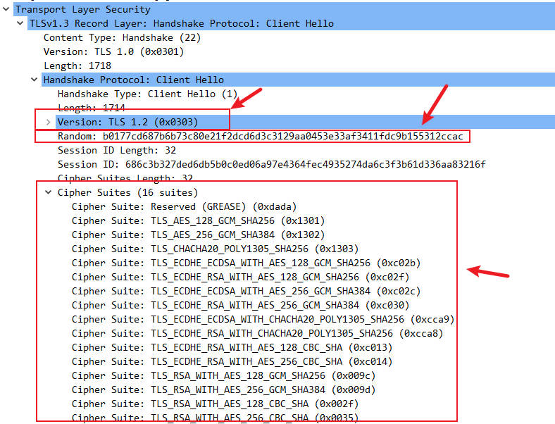
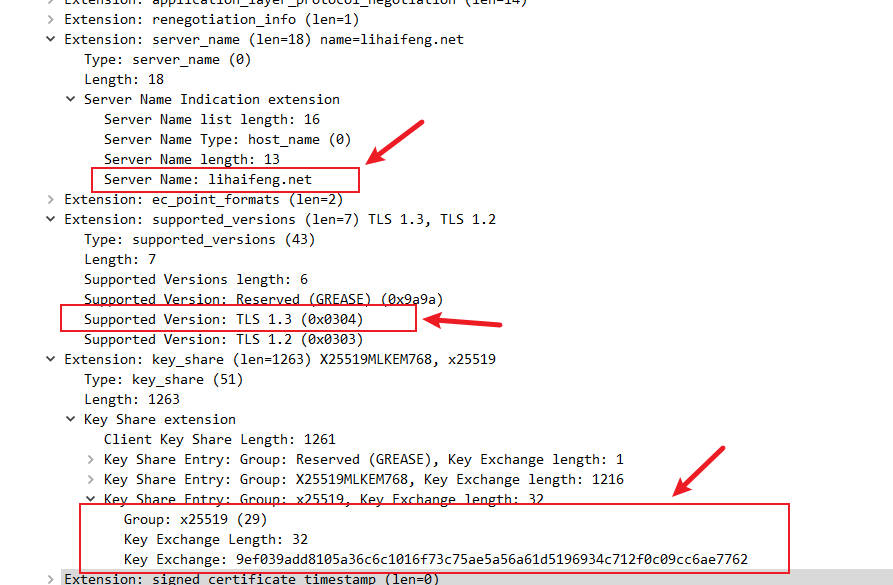
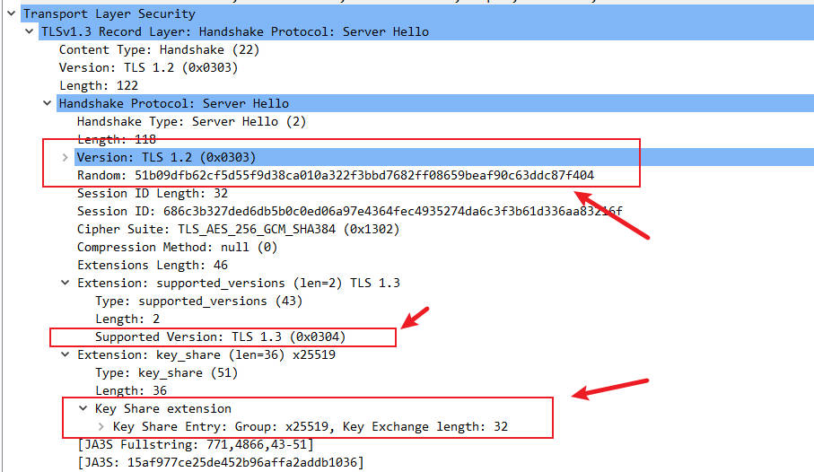
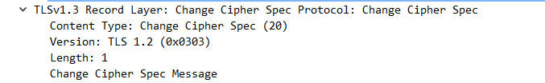
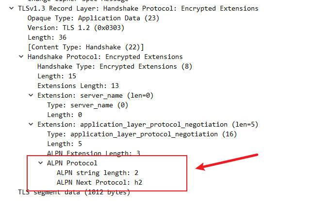
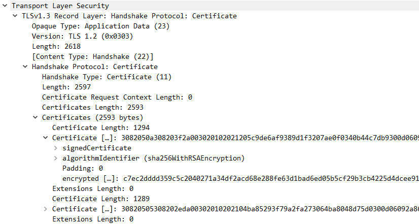
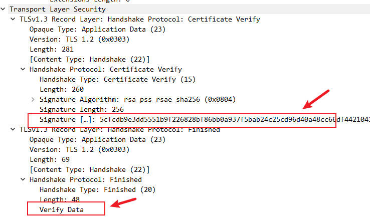

# Understanding TLS 1.3 with Wireshark

This article focuses on **TLS 1.3**, the latest and most secure version of the Transport Layer Security protocol. We’ll use **actual packet captures (pcap files) from Wireshark** to break down its negotiation process step-by-step, providing a direct view of how the magic of HTTPS connections unfolds.

We’ll analyze the role of each packet and delve into the significance of key “elements” within the pcap, giving you a clearer understanding of HTTPS security.

**Please note: The pcap data discussed in this article has been pre-decrypted for analysis.**

------

### Decrypting the HTTPS Negotiation Process

Let’s walk through a typical TLS 1.3 handshake, using the actual data streams captured in a Wireshark pcap file to explain each step in detail.

```
TLS 1.3 Handshake + Encryption Flow (Based on Wireshark Analysis)

┌───────────┐                                       ┌───────────┐
│  Client  │                                       │  Server   │
└─────┬─────┘                                       └─────┬─────┘
      │                                                   │
      │ 1. ClientHello                                    │
      │    - Version (TLS 1.2 for compatibility)          │
      │    - Client Random (32-byte)                      │
      │    - Cipher Suites (e.g., TLS_AES_128_GCM_SHA256) │
      │    - Extensions:                                  │
      │      * supported_versions (includes TLS 1.3)      │
      │      * key_share (ECDH public key, e.g., x25519)  │
      │      * server_name (SNI, e.g., lihaifeng.net)     │
      ├───────────────────────────────────────────────────>
      │                                                   │
      │                                                   │ 2. ServerHello
      │                                                   │    - Version (TLS 1.2 for compatibility)
      │                                                   │    - Server Random (32-byte)
      │                                                   │    - Selected Cipher Suite
      │                                                   │    - Extensions:
      │                                                   │      * supported_versions (confirms TLS 1.3)
      │                                                   │      * key_share (matching ECDH public key)
      │ <─────────────────────────────────────────────────┤
      │                                                   │
      │                                                   │ 3. Change Cipher Spec (no actual function)
      │ <─────────────────────────────────────────────────┤
      │                                                   │
      │                                                   │ 4. Encrypted Extensions
      │                                                   │    - Contains ALPN (e.g., h2)
      │ <─────────────────────────────────────────────────┤
      │                                                   │
      │                                                   │ 5. Certificate (encrypted)
      │                                                   │    - Server's certificate chain
      │ <─────────────────────────────────────────────────┤
      │                                                   │
      │                                                   │ 6. Certificate Verify (encrypted)
      │                                                   │    - Signature of handshake transcript
      │ <─────────────────────────────────────────────────┤
      │                                                   │
      │                                                   │ 7. Server Finished (encrypted)
      │                                                   │    - Verify Data (MAC of handshake hash)
      │ <─────────────────────────────────────────────────┤
      │                                                   │
      │ 8. Client Finished (encrypted)                    │
      │    - Verify Data (MAC of handshake hash)          │
      ├───────────────────────────────────────────────────>
      │                                                   │
      │ 9. Encrypted Application Data                     │ 9. Encrypted Application Data
      │    - Using derived directional keys               │    - Using derived directional keys
      ├───────────────────────────────────────────────────>
      │ <─────────────────────────────────────────────────┤
```


#### 1. `Client Hello` (Client -> Server)

This is the starting point of an HTTPS connection, initiated by the client (usually your web browser). In Wireshark, you’ll see a TCP packet containing the TLS `Client Hello` record.

------

##### Key Elements in the `Client Hello` Pcap:

- **`Version: TLS 1.2 (0x0303)`**: You might wonder why it shows `TLS 1.2`. This is a clever design choice in TLS 1.3 for backward compatibility. The version number in the `Client Hello` still declares support for TLS 1.2 or earlier. The actual TLS 1.3 version negotiation happens via the **`supported_versions` extension** later.
- **`Random` (Client Random):** A 32-byte random sequence. This random number is crucial for key derivation, as it works with the server random to provide unique randomness for the session.
- **`Cipher Suites`:** A list of encryption algorithms the client supports, such as `TLS_AES_128_GCM_SHA256` or `TLS_CHACHA20_POLY1305_SHA256`. TLS 1.3 cipher suites are more concise, directly specifying the authenticated encryption algorithm and hash function.



- `Extensions`:

     

    This is one of the most important parts of the

     

    ```
    Client Hello
    ```

    , containing:

    - **`supported_versions`:** Explicitly states the TLS versions the client supports, e.g., `TLS 1.3 (0x0304)`.
    - **`key_share`:** This is key to accelerating the TLS 1.3 handshake. The client **proactively generates a temporary Diffie-Hellman or Elliptic Curve Diffie-Hellman (DHE/ECDHE) public key** and includes it here. For instance, you might see `Group: x25519` followed by a long public key value.
    - **`server_name` (SNI):** Indicates the server domain name the client wishes to access. Although transmitted in plain text, it’s vital for the server to identify virtual hosts.



------

#### 2. `Server Hello`, `Change Cipher Spec`, `Encrypted Extensions`, `Certificate`, `Certificate Verify`, `Finished` (Server -> Client)

Upon receiving the `Client Hello`, the server parses the information and responds. In TLS 1.3, the server packs most of its response messages into one or a few TCP packets for rapid return.

------

##### Key Elements in the `Server Hello` Pcap:

- **`Version: TLS 1.2 (0x0303)`**: Similar to the `Client Hello`, the `Server Hello` also declares TLS 1.2 for compatibility.
- **`Random` (Server Random):** Another 32-byte random sequence, used with the client random for key derivation.
- **`Cipher Suite` (Selected Cipher Suite):** The server chooses one of the cipher suites supported by the client, for example, `TLS_AES_128_GCM_SHA256`.
- `Extensions`:
    - **`supported_versions`:** The server confirms the use of `TLS 1.3 (0x0304)`.
    - **`key_share`:** The server also generates its **temporary public key** based on the chosen key exchange group (e.g., `x25519`), and sends it to the client.



**At this point, both the client and server possess each other’s temporary public keys and their own temporary private keys, allowing them to independently compute the same** “**shared secret**.”

##### Key Elements in the `Change Cipher Spec` Pcap:

- This packet is retained in TLS 1.3 for **compatibility reasons only and serves no actual function** in the TLS 1.3 handshake. The transition to encryption happens implicitly.



##### Key Elements in the `Encrypted Extensions` Pcap:

- This is the first encrypted TLS record!

     

    It contains many extension details that were transmitted in plain text in TLS 1.2, such as:

    - **`Application-Layer Protocol Negotiation (ALPN)`:** Indicates the application-layer protocol (e.g., `h2` for HTTP/2, `http/1.1` for HTTP/1.1).



**Core Concept: How is the server able to encrypt this message?**

This is possible because, during the `Server Hello` phase, both parties have already computed a **shared secret** via the ECDHE algorithm. Based on this shared secret, and using the Key Derivation Function (HKDF), they have derived the **handshake traffic keys** used to encrypt handshake messages. Therefore, from `Encrypted Extensions` onwards, all subsequent handshake messages are encrypted.

------

##### Key Elements in the `Certificate` Pcap:

- This message is **encrypted**.
- **Certificate Chain:** Contains the server’s digital certificate and its issuer certificates (up to the root certificate). The client validates this chain to confirm the server’s identity and the certificate’s validity. The certificate **contains the server’s long-term public key**.



##### Key Elements in the `Certificate Verify` Pcap:

- This message is also **encrypted**.
- **Digital Signature:** The server uses its **long-term private key**, which is tied to its digital certificate, to **digitally sign a hash of all handshake messages from the `Client Hello` up to the `Certificate` message**.
- The client uses the server’s **long-term public key** from the certificate to verify this signature. **This is a crucial step for ensuring that plain-text information like `Client Hello` and `Server Hello` (including `key_share`) has not been tampered with and for authenticating the server’s identity.**

##### Key Elements in the `Finished` Pcap:

- This is the final encrypted handshake message.
- **`Verify Data`:** This is a Message Authentication Code (MAC) calculated over a hash of all preceding handshake messages. It serves as a final integrity check, confirming that both parties have derived the same shared secret and that no part of the handshake was tampered with.
- **Handshake Integrity Verification:** The `Finished` message also contains a Message Authentication Code (MAC), which is calculated from a **hash of the entire handshake process**.
- Both parties verify each other’s `Finished` messages to confirm the integrity and consistency of the handshake.



------

#### 3. `Finished` (Client -> Server)

After the client receives and successfully verifies the server’s `Finished` message, it also sends an encrypted `Finished` message to the server, completing its part of the handshake integrity verification.

At this point, the TLS 1.3 **1-RTT handshake is officially complete!** Both parties have securely established a connection and derived the **application traffic keys** for encrypting subsequent application data.

------

### From Negotiation to Encryption: The Roles of Public and Private Keys

Throughout the negotiation process, public and private keys play indispensable roles:

- Temporary Public/Private Key Pair (ECDHE/DHE Key Share):
    - **Temporary Public Key** (carried in `key_share`): Used for exchange in a plaintext environment and, when combined with the other party’s temporary private key, to compute the shared secret. Even if intercepted, the private key cannot be reverse-engineered.
    - **Temporary Private Key** (generated locally, never transmitted): Used with the other party’s temporary public key to compute the shared secret.
    - **Role:** Ensures **Perfect Forward Secrecy (PFS)**, meaning even if the server’s long-term private key is compromised in the future, past sessions cannot be decrypted.
- Server’s Long-Term Public/Private Key Pair (Certificate & Certificate Verify):
    - **Long-Term Private Key** (held by the server): Used to **digitally sign** handshake messages, proving the server’s identity and ensuring the integrity of the handshake process.
    - **Long-Term Public Key** (transmitted in the certificate): Used by the client to **verify** the server’s digital signature.
    - **Role:** Establishes **trust**, authenticates the server’s identity, and prevents man-in-the-middle attacks and tampering.

------

### Key Derivation and Directional Keys

From the single **shared secret** established during the key exchange, TLS 1.3 uses a robust Key Derivation Function (HKDF) to generate multiple distinct symmetric encryption keys. Notably, **TLS 1.3 derives independent keys for each direction of communication (client-to-server and server-to-client)**. This further enhances security by preventing the reuse of keys across different communication flows and strengthening resistance against various cryptographic attacks.

------

### Conclusion

By analyzing Wireshark pcap files, we can gain insight into the intricate negotiation process of HTTPS connections under TLS 1.3. From the plaintext `Client Hello` and `Server Hello`, to the shared secret computed using temporary keys, and finally to the identity verification signed by the long-term private key, each step is interconnected, collectively building a fast, efficient, and exceptionally robust secure channel.