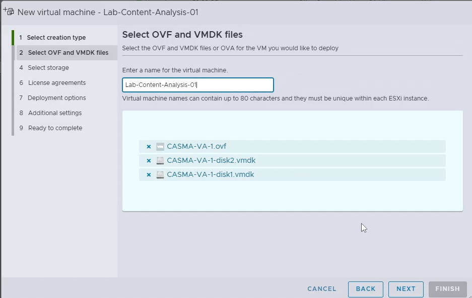
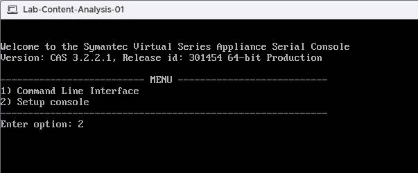

# Installing Symantec Content Analysis on VMware ESXi

Symantec Content Analysis (CA) provides advanced malware analysis and detection capabilities, designed to integrate seamlessly with Symantec security products. This guide explains how to install Content Analysis on a VMware ESXi host.

------

## Prerequisites

Make sure you have the following before beginning:

- **VMware ESXi host** (6.5, 6.7, 7.x, and 8.x).

- OVF package

   

  for Symantec Content Analysis:

  - 1 × OVF file
  - 2 × VMDK files

- Access to the **ESXi web interface** (vSphere Client or HTML5 UI).

- Adequate host resources:

  - CPU: 4 vCPUs
  - Memory: 16 GB RAM
  - Disk: 100 GB

- A valid **serial number** and **license** for Symantec Content Analysis.

> > For detailed hardware and software requirements, please refer to the official documentation:
> > [Symantec Content Analysis System Requirements](https://techdocs.broadcom.com/us/en/symantec-security-software/web-and-network-security/content-analysis/3-0/vm_requirements/system_requirements_gen2.html)

------

## Step 1: Deploy the OVF Package

- From the ESXi web interface, go to **Virtual Machines → Create / Register VM**.
- Choose **Deploy a virtual machine from an OVF or OVA file**.

- Provide a name for the VM (e.g., `Symantec-CA`).
- Upload the **OVF file** and the **two VMDK files**.

- Select the **datastore** where the VM will be stored.

- Map the **network interface** to the correct ESXi port group.

------

## Step 2: Provide Serial Number

- After deployment is complete, select the new `Symantec-CA` VM.
- Click **Power On**.
- Open the **Console** of the VM.
- When prompted, enter your **serial number** to continue.

- Type **2** to select **Setup Console**.

------

## Step 3: Configure Network Interfaces

1. In the setup console, configure the

    

   management interface

   :

   - IP Address
   - Subnet Mask
   - Default Gateway
   - DNS Servers

------

## Step 4: Set Console and Enable Passwords

1. In the same setup wizard, configure:
   - **Console password**
   - **Enable password** (for privileged access)

------

## Step 5: Access the Web Interface

1. Once setup is complete, open a browser and navigate to: `https://<Content-Analysis-IP>:8082`
2. Log in with the credentials you just created.
3. Log in using the credentials you created during setup. The first time you log into the web management console, you are prompted to configure the **virtual appliance certificate**, which also contains the **virtual appliance base license**.

------

## Step 6: Activate the License

- Navigate to **System → Licensing**.
- If you did not configure the **virtual appliance certificate** during the first login, the license status will show as **Unavailable**. When you refresh the page, the system will again prompt you to configure the virtual appliance certificate. Enter your username and password, then complete the certificate configuration.

- After that, the license status should change to **Active**.
- If it still shows **Unavailable**, use the **Download License from Symantec** option. Refresh the page again and verify that the license status is now **Active**.

------

## Conclusion

You have now successfully installed Symantec Content Analysis on VMware ESXi and activated the license. From here, you can proceed to configure malware scanning engines, proxy integration, and logging for your environment.