# Deploy Symantec Management Center on Azure

## Prerequisites

- An active **Azure subscription**
- **Symantec Azure VHD image** (download from Broadcom Support)
- A planned **Resource Group (RG)** and **Virtual Network (VNet)**

------

## Upload the VHD to Azure Storage

- Sign in to Azure Portal.
- Go to **Storage accounts** → **Create**.
    - Subscription: choose your subscription
    - Resource Group: select or create (e.g., `smc-rg`)
    - Storage account name: e.g., `smcstorageacct`
    - Region: must match the VM deployment region
    - Performance: Standard
    - Redundancy: LRS
    
    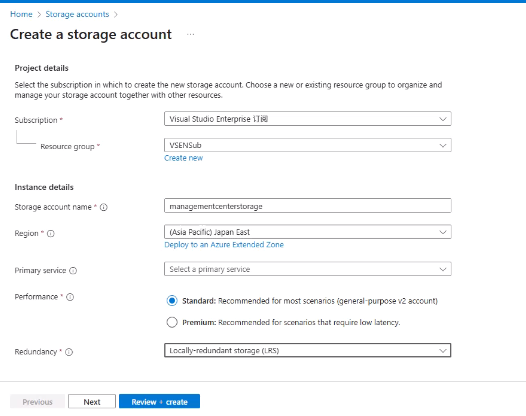
    
- After the storage account is created, open it.
- In the left menu, go to **Containers** → **+ Container**. Name it(e.g., `vhds`).

​	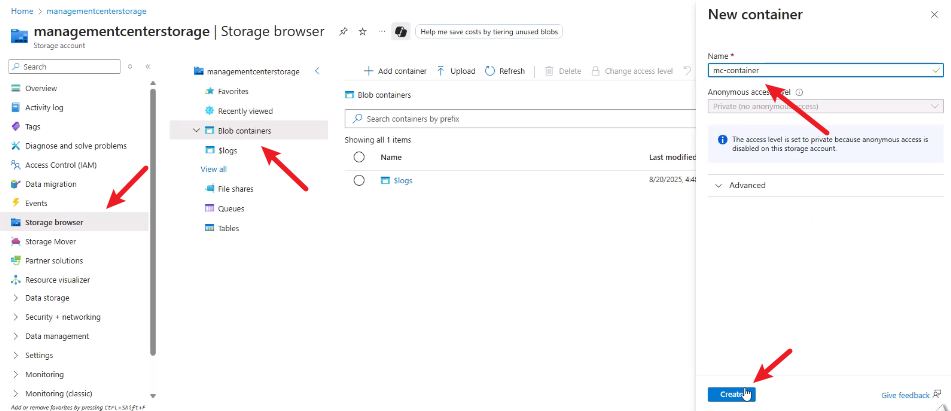

- Open the container and click **Upload**. Select the downloaded VHD file, and set **Blob type = Page blob**. Start upload.

​	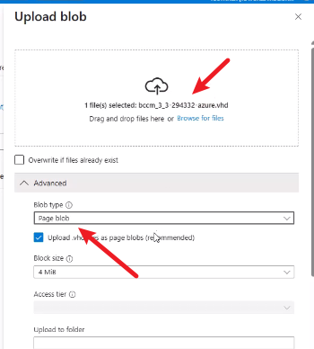

------

## Create an Image from the VHD

- In Azure Portal, search for **Images** → **+ Create**.
- Configure:
    - Subscription / Resource Group: same as before
    - Image name: e.g., `smc-image`
    - Region: same as storage account
    - OS type: Linux
    - OS disk: browse and select the uploaded VHD in the `vhds` container
    
    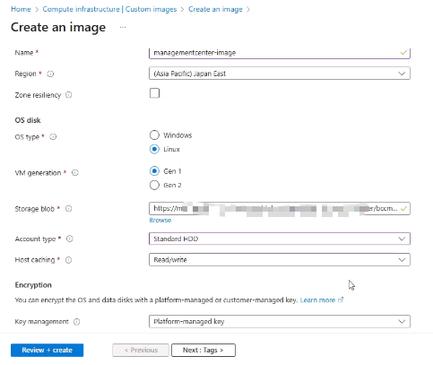
- Click **Review + Create** → **Create**.

------

## Create a VM from the Image

- In Azure Portal, search for **Images → **+ Create  VM**.

    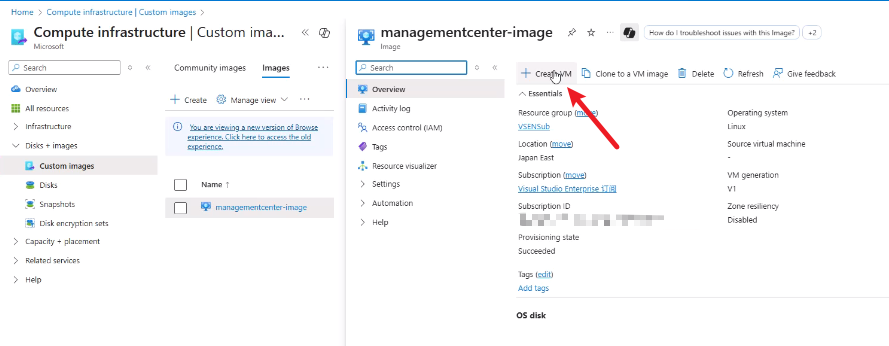

- Basics:

    - Subscription / Resource Group: same as before

    - VM name: e.g., `smc-vm`

    - Region: same as image

    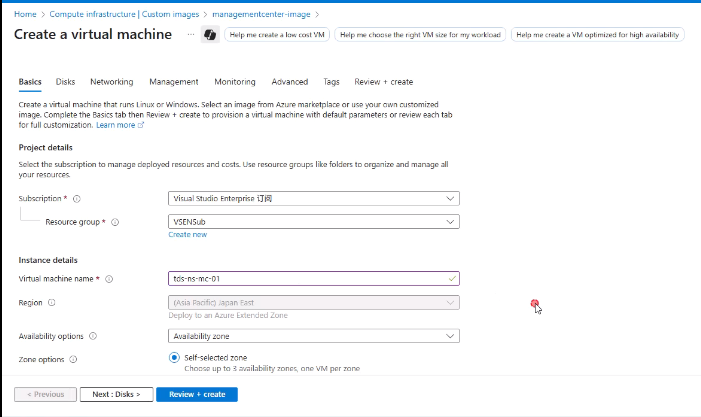

    - Image: choose **My Images** → select `smc-image`

    - Size: The official documentation suggests **B2S** (2 vCPU / 4 GB RAM).

        > In practice, B2S can be underpowered. A better choice is a VM with **2 vCPU / 8 GB RAM** (e.g., **Standard_D2s_v3**).

    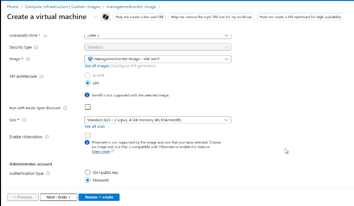

- Administrator account:

    - Any username and password
    - **Note:** These credentials are for VM management only. Management Center login credentials are set in **Custom Data**.

- Disks:

    - Click **+ Create and attach a new disk**.
    - Disk name: `smc-data-disk`

    - Storage type: Standard HDD (or SSD if preferred)

    - Size: **32 GiB**

​	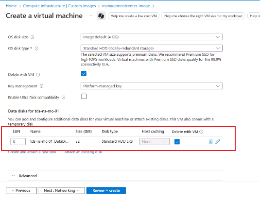

- Networking:

    - Choose VNet and subnet
    - Assign a public IP

    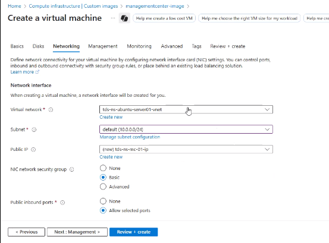

    - **Allow 22 (SSH)**

    > Port **8082 (MC Web Console)** must be added later after the VM is deployed

- Custom Data: Under **Advanced → Cloud init / Custom data**, paste the following:

    ```
    {
      "serial_number": "your-serial-number",
      "password": "your-login-password",
      "enable_password": "your-enable-password",
      "hostname": "smc-azure"
    }
    ```

    - `password`: password for MC CLI / UI login
    - `enable_password`: password for enable mode

    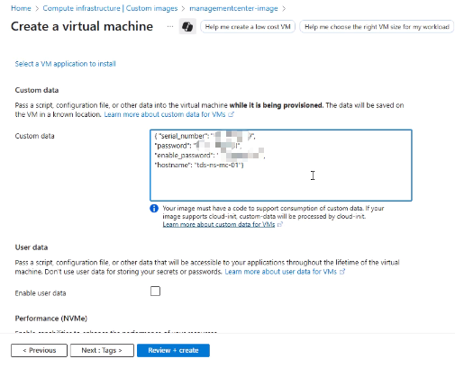

- Click **Review + Create** → **Create**.

------

## Initial Access

- Once the VM is deployed, go to the VM overview page and copy the **Public IP**.

- Update the NSG to add a rule allowing inbound traffic on port **8082 (MC Web Console)**.

    > Other required ports should be configured as needed. Please refer to the official documentation:
    >  [Required Ports, Protocols, and Services](https://techdocs.broadcom.com/us/en/symantec-security-software/web-and-network-security/management-center/4-1/MC-initial-configuration/KVM-ref-toc/Ensure-Connectivity.html)

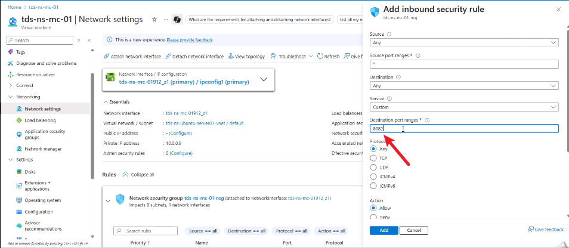

- Open a browser and access:

    ```
    https://<Public-IP>:8082
    ```

- Login:

    - Username: `admin`
    - Password: the value set in **Custom Data → password**

------

## Activate the License

- In the Management Center web console, go to: **Administration → License**

- Open the **Install New License** tab

- Enter your **Broadcom Support user ID and password**

- Click **Install License**

    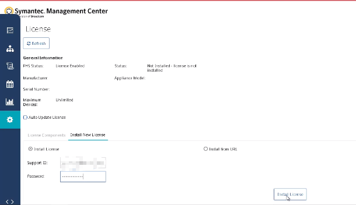

- Click **Refresh** to update the License Components table

    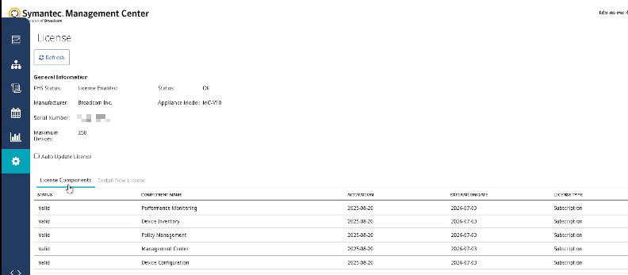

------

## Next Steps

- Add and manage **Reporter / Edge SWG / Content Analysis** devices
- Monitor and Configure the devices