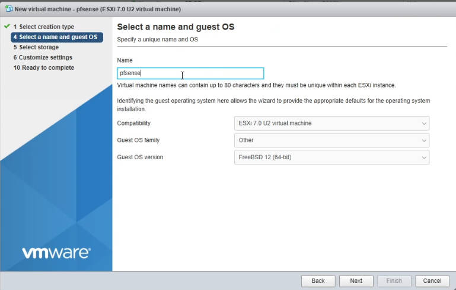

# Installing pfSense on ESXi

This guide will walk you through the process of installing pfSense as a virtual machine on VMware ESXi. The pfSense project is a free network firewall distribution, based on the FreeBSD operating system with a custom kernel and including third party free software packages for additional functionality. 

## Before You Begin

Before you start, make sure you have the following:

**ESXi Host**: A running ESXi host with sufficient resources. Recommended hardware configuration:

- **CPU**: At least 1 vCPUs (2 or more recommended for better performance)
- **RAM**: Minimum 1 GB (4 GB or more recommended)
- **Storage**: At least 8 GB of available disk space for the virtual machine
- **Network Interfaces**: At least 2 virtual NICs (1 for WAN, 1 for LAN)
- View [Hardware Sizing Guidance](https://docs.netgate.com/pfsense/en/latest/hardware/size.html) and [Minimum Hardware Requirements](https://docs.netgate.com/pfsense/en/latest/hardware/minimum-requirements.html)

**ESXi Access**: Access to your ESXi host via vSphere Client or the ESXi Host Client (web interface).

**Network Configuration**: Plan your network configuration for pfSense. You’ll typically need:

- One network adapter connected to the WAN (Internet)
- One network adapter connected to the LAN (internal network)

## **Downloading pfSense**

Go to the official pfSense website: https://www.pfsense.org/download/

Alternatively, for a more direct download without login requirements, you can use this mirror: https://repo.ialab.dsu.edu/pfsense/.

Download the **.iso.gz** file. Remember, you’ll need to **extract the .iso file** from the .gz archive using a tool like 7-Zip or WinRAR before you can upload it to your ESXi datastore.

## **Creating a New Virtual Machine in ESXi**

1. Log in to your ESXi Host Client (web interface) or vSphere Client
2. Navigate to Virtual Machines and click Create/Register VM.
3. Select Create a new virtual machine and click Next.
4. Name your virtual machine (e.g., “pfSense-Firewall”).
5. For Guest OS family, select Other.
6. For Guest OS version, select FreeBSD 64-bit. Click Next.
7. Select your datastore where you want to store the VM files. Click Next.
     - When selecting the FreeBSD version, you can refer to the official release notes for guidance: [pfSense Release Versions](https://docs.netgate.com/pfsense/en/latest/releases/versions.html).
8. Customize your hardware settings:
      - CPU: Allocate at least 1-2 vCPUs.
      - Memory: Allocate at least 1-2 GB of RAM (more if you plan to run packages).
      - Hard Disk: Add a new hard disk, typically 8-16 GB is sufficient. Choose Thin Provision for space efficiency.
      - Network Adapters: This is crucial.
      - Add at least two Network Adapters.
      - One adapter will be for your WAN interface. Assign it to a virtual switch connected to your internet uplink.
      - The second adapter will be for your LAN interface. Assign it to a virtual switch that will connect to your internal network VMs.
      - CD/DVD Drive 1: Select Datastore ISO file and browse to upload the pfSense ISO you downloaded and extracted.
   1. Review your settings and click Finish.

## **Installing pfSense**

1. Power on the newly created pfSense VM.
2. Open the console for the VM.
3. The pfSense installer will boot. Press Enter to accept the default options.
4. Choose Install to proceed with the installation.
5. Select Auto (UFS) for the partitioning method. This is generally recommended for most users.
6. Confirm the installation by selecting OK.
7. The installation process will begin. Once complete, you’ll be prompted to reboot.
      - Important: Before rebooting, disconnect the pfSense ISO from the virtual machine’s CD/DVD drive to prevent it from booting back into the installer. You can do this by editing the VM settings in ESXi.
8. Now, select Reboot to boot into your new pfSense installation.

## **Initial Configuration of pfSense**

After the reboot, pfSense will boot up and present you with the console menu.

1. Assign Interfaces:
      - You’ll likely be prompted to assign your network interfaces. pfSense will typically detect your virtual network adapters as vmx0, vmx1, etc.
      - Identify which vtnet corresponds to your WAN and which to your LAN based on the order you added them in ESXi or by MAC address.
      - Enter the appropriate vtnet interface names for your WAN and LAN interfaces.
2. Configure WAN Interface (DHCP or Static IP):
      - If your WAN connection uses DHCP (common for home users), pfSense will likely obtain an IP address automatically.
      - If you need a Static IP for your WAN, you’ll enter the IP address, subnet mask, and gateway.
3. Configure LAN Interface (DHCP or Static IP):
      - You need to set the LAN IP address. This will be the IP address of your pfSense firewall on your internal network (e.g., 192.168.1.1).
      - Set the subnet mask for your LAN (e.g., 24 for /24 or 255.255.255.0).
      - You can enable the DHCP server on the LAN interface to automatically assign IP addresses to your internal devices.
4. Access the Web Interface:
      - Once the initial console configuration is complete, you should be able to access the pfSense web interface from a device on your LAN network.
      - Open a web browser and go to the LAN IP address you configured (e.g., https://192.168.1.1).
      - The default credentials are username: **admin** and password: **pfsense**.
      - You will be guided through an initial setup wizard in the web interface, which will allow you to change the admin password, configure DNS servers, and set the time zone.

## **Post-Installation Steps**

After the initial setup, consider these important steps:

1. Change Default Passwords: Immediately change the default admin and pfsense passwords in the web interface. This is a critical security measure.
2. Change Language (Optional): If needed, you can change the language of the pfSense web interface under System > General Setup > Language.

## References

**pfSense Hardware Sizing Guide:** https://docs.netgate.com/pfsense/en/latest/hardware/size.html

**pfSense Minimum Hardware Requirements:** https://docs.netgate.com/pfsense/en/latest/hardware/minimum-requirements.html

**Official pfSense Download Page:** https://www.pfsense.org/download/

**pfSense DSU Mirror Download:** https://repo.ialab.dsu.edu/pfsense/

**pfSense Release Versions:** https://docs.netgate.com/pfsense/en/latest/releases/versions.html

**pfSense Getting Started Guide:** https://www.pfsense.org/getting-started/

**pfSense Installation Guide (Chinese Blog):** https://www.cnblogs.com/lsdb/p/10006377.html

**pfSense Setup Guide (Japanese Blog):** https://www.sakamoto.blog/pfsense-setup/